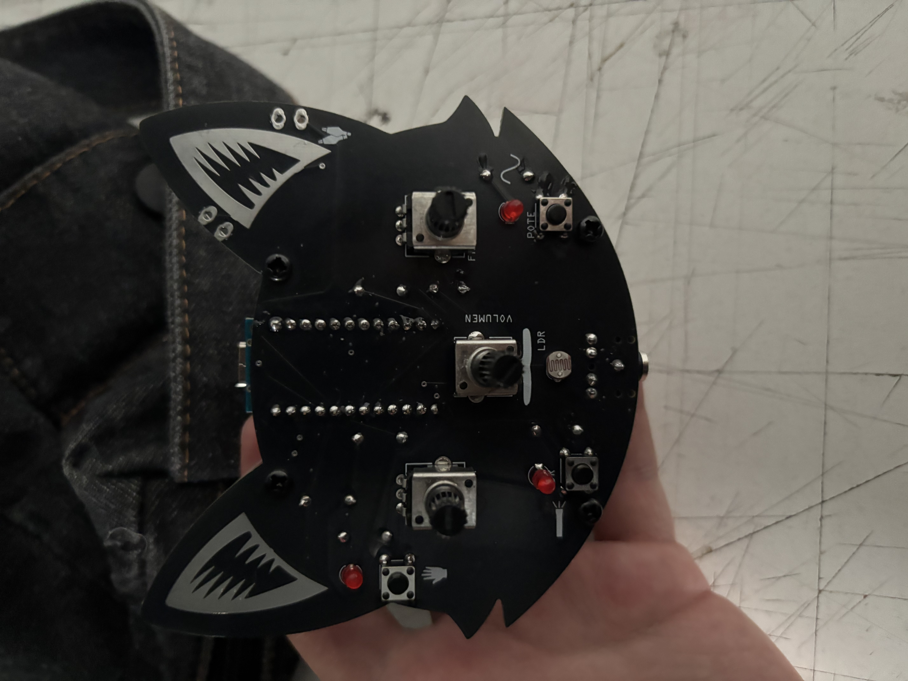

# sesion-01a

## Encargo 01

En Sisters with Transistors se muestra cómo muchas mujeres pioneras usaron máquinas, cintas y sintetizadores para crear un nuevo lenguaje musical.
Artistas como Clara Rockmore con el theremin, Delia Derbyshire, Daphne Oram y Eliane Radigue exploraron sonidos nuevos como manipular cintas, dibujar sonido, trabajar con ruidos cotidianos o transformar sonidos reales en otros inexistentes.
También compositoras como Pauline Oliveros, Wendy Carlos y Laurie Spiegel mostraron que la música electrónica podía expresar emociones, crear experiencias inmersivas y transformar la música clásica y experimental.
Aunque muchas veces su trabajo fue considerado solo ruido o quedó oculto en un campo dominado por hombres, estas artistas fueron fundamentales para crear y desarrollar la música.

Escogí a Laurie Spiegel, es una compositora estadounidense de música electrónica y también conocida por su software de composición electrónica Music Mouse, creación en la que me enfocaré más tarde en este texto. Laurie estudió Ciencias Sociales  para luego viajar a Nueva York, donde se dedicó un año a la ciencias para después estudiar composición con Jacob Druckman, Vincent Perischetti, etc entre 1969 y 1972 en Juilliard School. Completó su MA en composición el año 1975. Aunque Laurie trabajó profundamente con tecnología y computación, nunca dejó que la técnica dominara su música. en los 70 utilizó algoritmos para crear composiciones accesibles y cercanas al minimalismo. Sin embargo, su obra va más allá de ese término, combina cambios sonoros lentos con timbres complejos, una energía fría y momentos de gran intensidad. su música refleja su intuición y creatividad apoyadas por un sólido dominio técnico. Algunas obras son Unseen Worlds de 1991 o su obra debut The Expanding Universe de 1908 que contiene cuatro piezas creadas usando el sistema GROOVE de Bell Labs. Pero ahora hablaré de Music Mouse, este es un software pionero de composición algorítmica creado en 1986 para Macintosh, Amiga y Atari. Funciona como un instrumento inteligente que transforma los movimientos del mouse en tiempo real a melodías. El movimiento horizontal y vertical del mouse genera líneas musicales que se entrelazan, mientras que su sistema de lógica armónica mantiene la coherencia musical. Se puede usar para improvisar, explorar ideas o controlar instrumentos externos de forma expresiva y directa. Algunas obras que Laurie creo en Music Mouse son Cavis Muris en 1986 o Three Sonic Spaces en 1989 entre otras. Estuvo disponible hasta 2021, en 2023 la web dejó de estar activa pero en 2026, Eventide lo relanzó en colaboración con Spiegel.
 
### Referencias:
 
https://www.eventideaudio.com/software/music-mouse/#:~:text=ahora%20por%20$29-,Un%20instrumento%20musical%20inteligente,con%20un%20control%20humano%20expresivo.
 
https://es.wikipedia.org/wiki/Laurie_Spiegel
 
https://en.wikipedia.org/wiki/Music_Mouse#:~:text=Music%20Mouse%20es%20un%20software,est%C3%A1%20archivado%20en%20Wayback%20Machine.&text=En%202026%2C%20Eventide%20lo%20relanz%C3%B3%20en%20colaboraci%C3%B3n%20con%20Spiegel.
 
https://pitchfork.com/reviews/albums/laurie-spiegel-unseen-worlds/
 
https://www.tableoftheelements.co.uk/laurie-spiegel
 
Sisters in Transistors documental. (no se como poner el link)

### Imagenes de la clase

