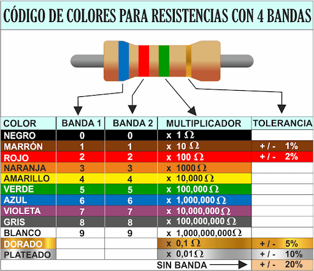
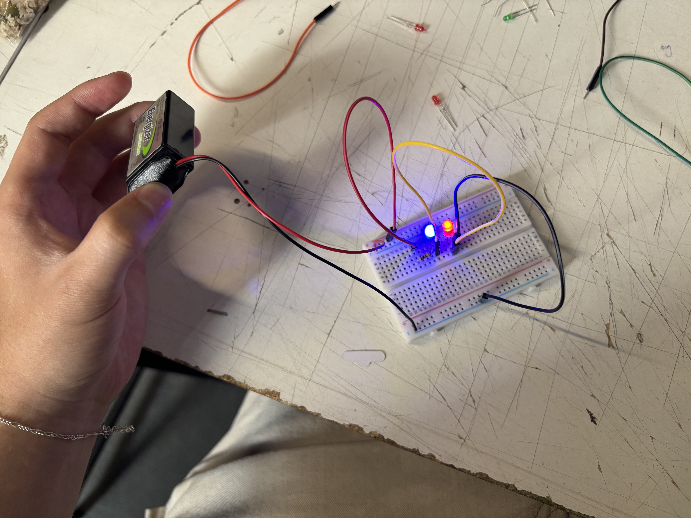
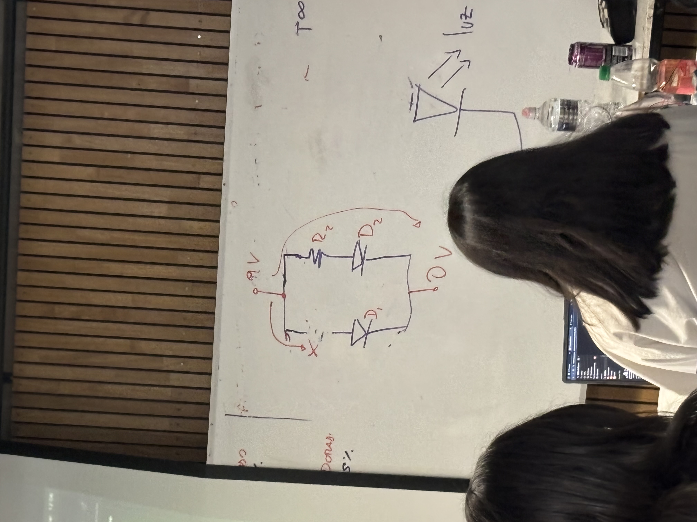
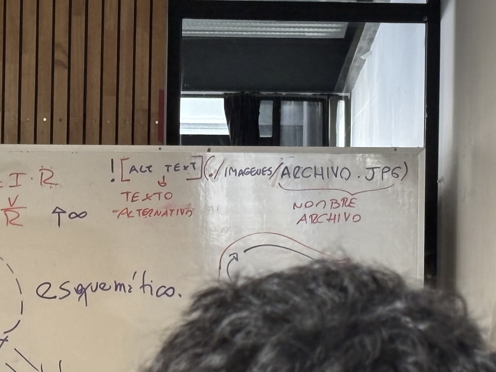
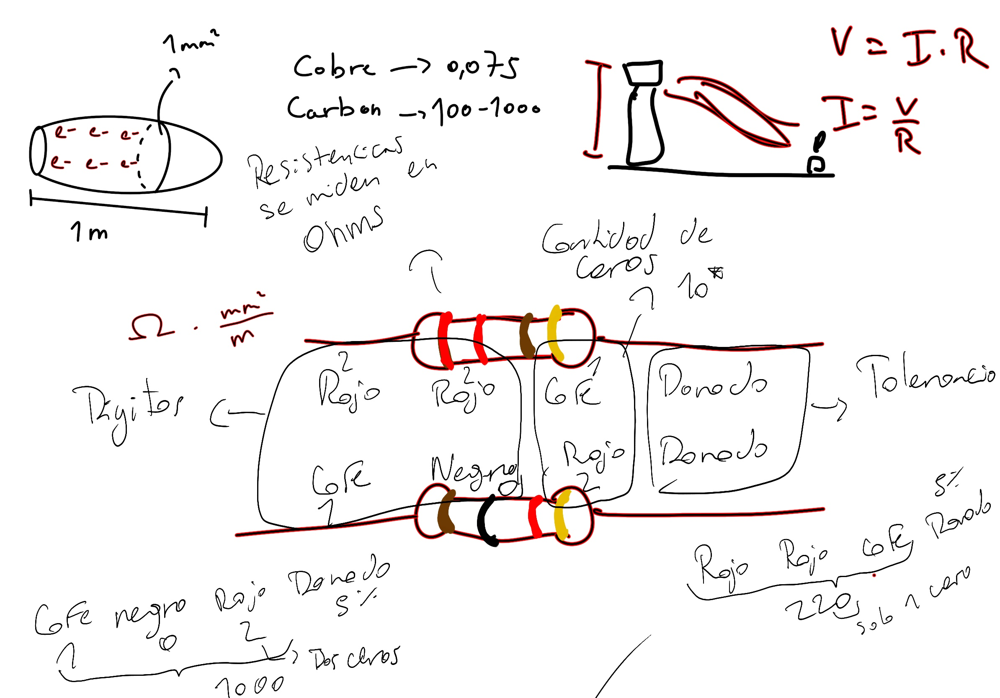
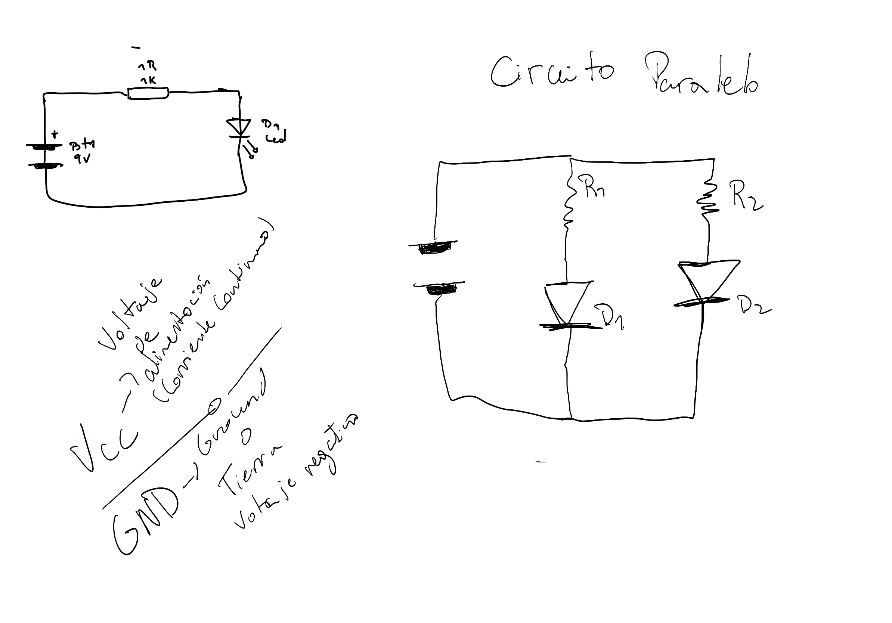

# sesion-02a

## Materiales

Batería energizer 9v 6 horas para cargar

Cables dupont dupont (doble punta) usar cables en modo ordenado, cada color para alguna cosa

Parlante

Protoboard

Potenciómetro b100k (si es a es más caro)

Chips, son simétricos se ponen encima del eje del protoboard, no en el mismo lado, los números que salen en el chip identifican de qué serie es y qué puede hacer

Resistencias 

Broche de batería, se le conecta la batería y transporta energía al circuito

Todo material se resiste pero el cobre se resiste menos 

Cobre = 0,075

Carbón = 100 - 1000

### Conductores:

Hierro

Plata

Oro

Cobre

Aluminio

### Aislante:

Vidrio

Tierra

Plástico

Madera

Cuero

¿Aire? Depende de las condiciones 

### Código de color de resistencia 

### Fotos de la clase y apuntes

## Encargo 03 LQXTLC

### Ejercicio 1

| Protoboard | D1 | D2 | D3 | D4 |
| :--- | :---: | :---: | :---: | ---: |
| R1 | 0 | 0 | 0 | 0 |
| R2 | 1 | 0 | 0 | 1 |
| R3 | 1 | 1 | 1 | 0 |
| R4 | 1 | 1 | 1 | 0 |
| R5 | 1 | 0 | 0 | 1 |

