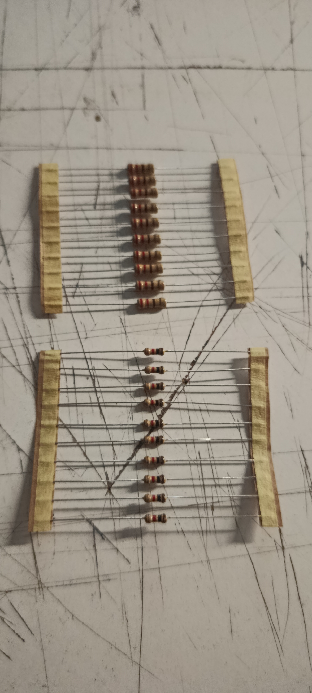
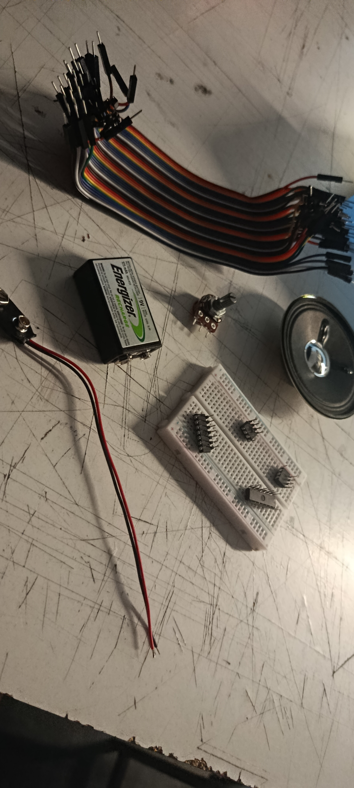
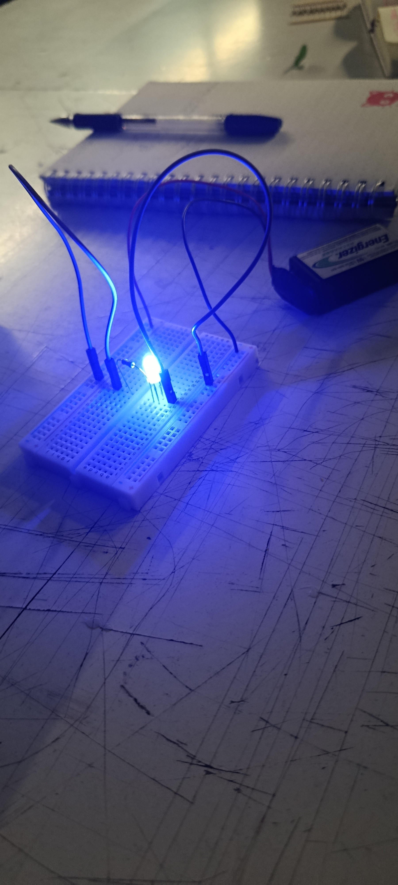

# sesion-02a

## Apuntes clase viernes 17.03.2026

En esta clase se habló sobre las resistencias, el por qué tiene colores y que significan estos y en que se diferencian. Cada color indica algo diferente pero que en su total hace cuando es el numero de la resistencia, es decir dos de esos colores que suelen ser los primeros dos indica cual es el digito, y en el tercer color nos dira cuanta cantidad de ceros lleva el total de la resistencia, nota adicional el dorado o plata equivale a la tolerancia. Y con esto podemos saber cuanto equivale la resistencia, tambien hay paginas o una app en concreto con la que podemos calcular esto con mas facilidad, la aplicación se llama **Electrodoc**

**imagen explicativa de valores y cada color resistencia**

También en la clase nos pasaron nuestros materiales en una caja, en el cual estan varios componentes, como los cables, una protoboard, un parlante en mi caso, resistencias, bateria, leds. Con esto durante la clase fuimos haciendo y aprendiendo mas sobre circuitos, en donde se conecto primero la resistencia, luego la led, siguiente paso fue conectar los cables, y posteriormente conectar la energia para que si se hizo todo bien la led se encienda, luego en la clase vimos como poder leer planos tecnicos y aprender como a travez de esos planos poder conectar por cuenta propia a la protoboard, el como tambien se conectan los mismos componentes al plano, la idea es que claramente durante las proximas clases nosotros podamos leer estos planos sin mucha ayuda y tambien saber como hacerlos.

        
  
    

**Imagenes de proceso y materiales**

Y como a modo de repaso en lo digital, aprendimos a poner imagenes en github y un poco más como funciona esta misma, lo que es brunch y que tenemos de tener cuidado a no crear un brunch por error. Para poder poner imagenes, se debe cargar primero la imagen en la carpeta de imagenes, recomendable poner un nombre a la imagen antes de subirla, y luego de haber subido la imagen o las imagenes que queramos subir debemos poner el comando.

## Prueba imagen 

