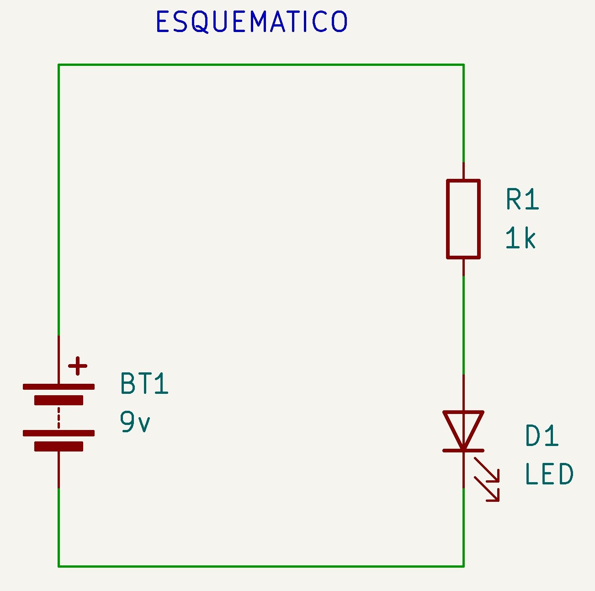
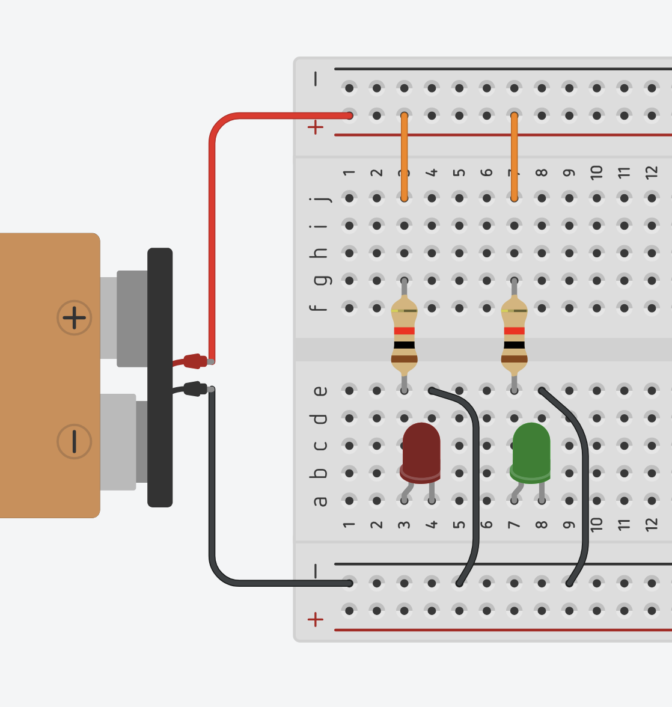
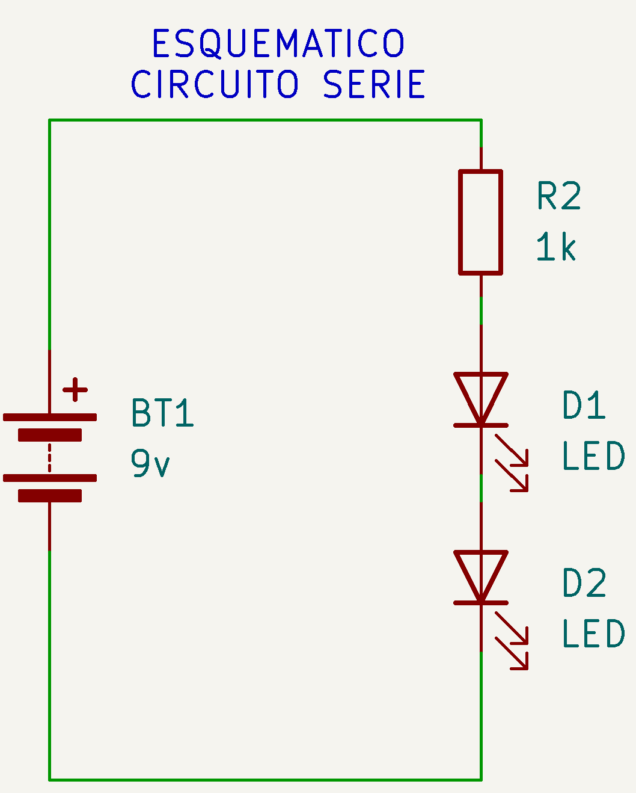
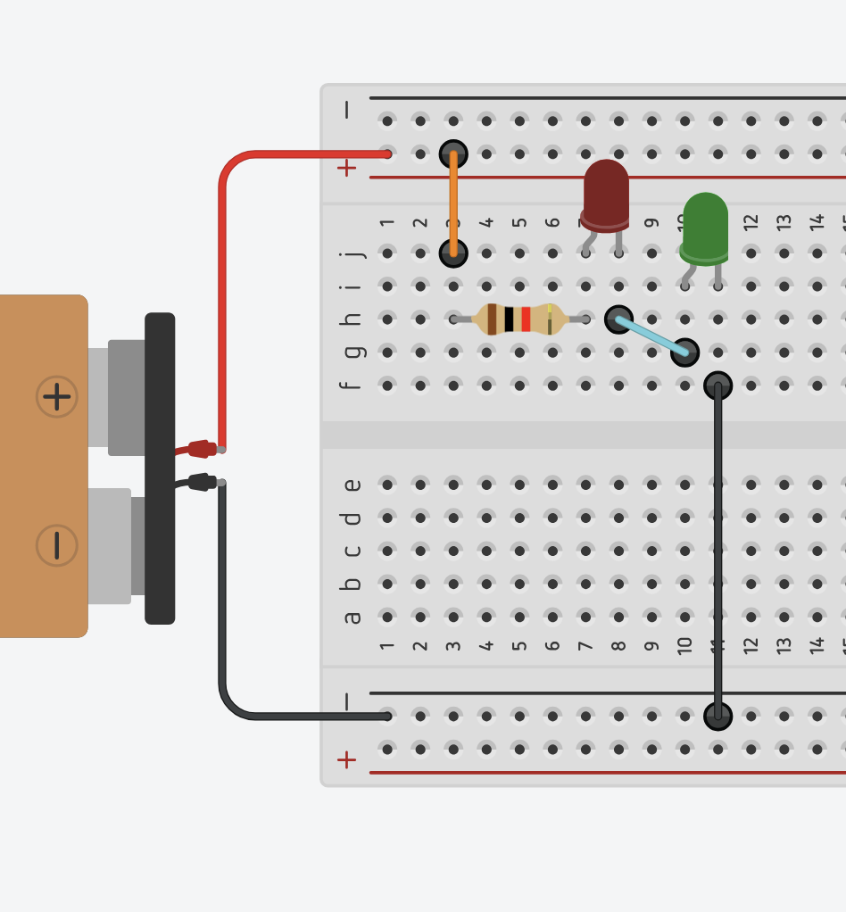
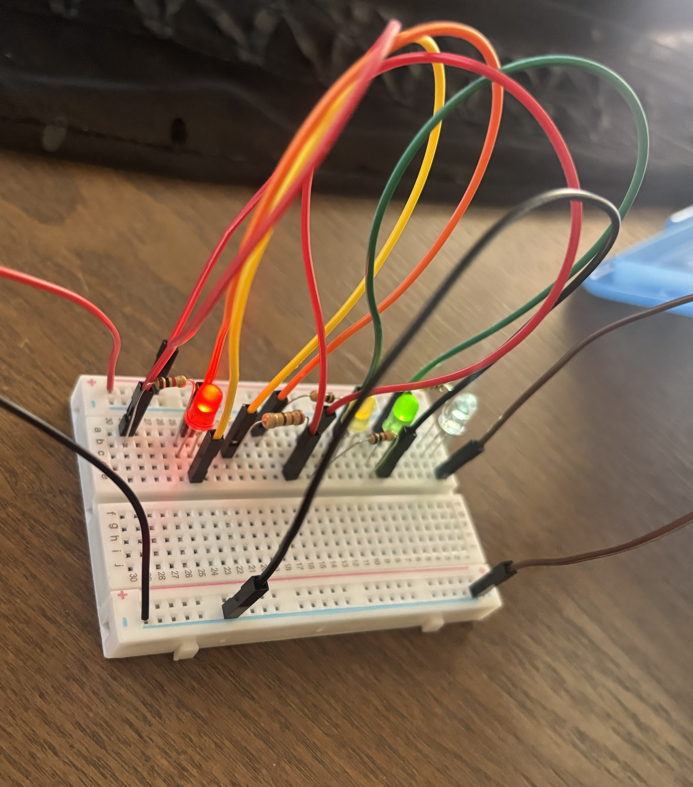
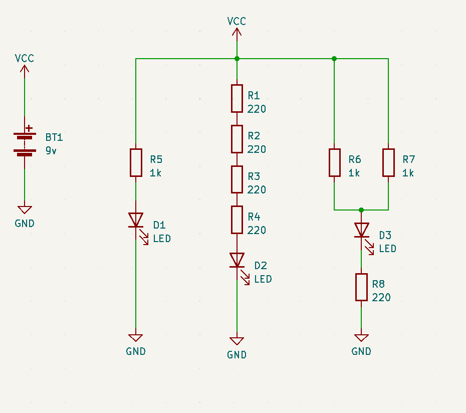
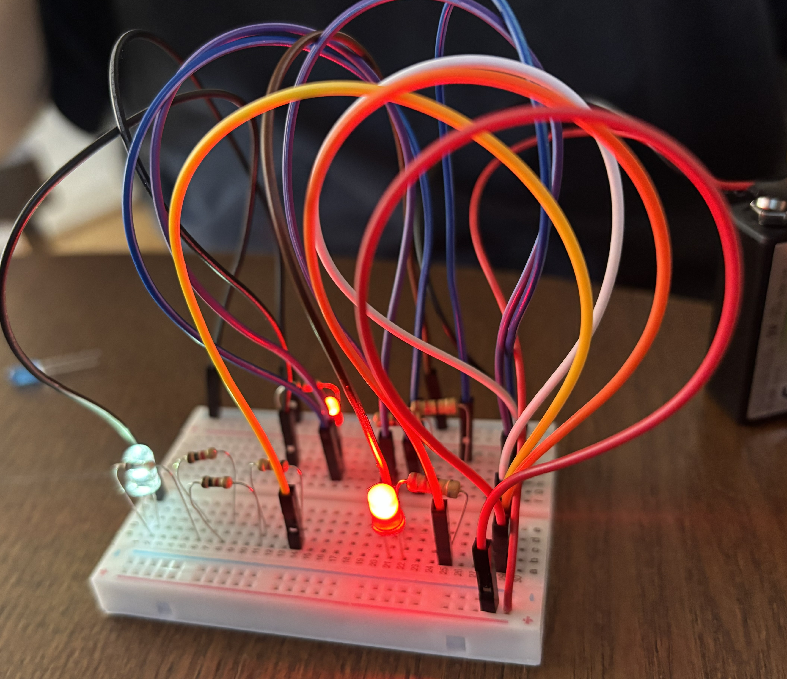
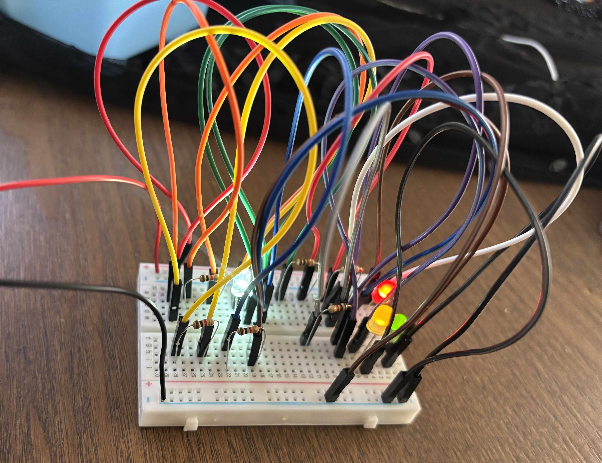

# sesion-02a

## Materiales
- Protoboard  
- Resistencias 220 y 1k  
- Parlante  
- Batería  
- Cable de batería  
- Cables  
- Chips  
- Leds  

## Circuito básico

## Circuito paralelo
Los componentes están en ramas independientes. Tienen el mismo voltaje, la corriente se divide y, si uno falla, los demás siguen funcionando.

## Circuito en serie
Los componentes se conectan en un solo camino. La corriente es la misma en todo el circuito, el voltaje se reparte y la resistencia total es la suma de las resistencias.

## Encargo circuitos

## Ejercicio 1

| loquitoportilocoloco  | D1    | D2    | D3    | D4    |
| ---                   | ---   | ---   | ---   | ---   |
| R1                    |   0   |   0   |   0   |   0   |
| R2                    |   1   |   0   |   0   |   1   |
| R3                    |   1   |   1   |   1   |   0   |
| R4                    |   1   |   1   |   1   |   0   |
| R5                    |   1   |   0   |   0   |   1   |

## Ejercicio 2

| loquitoportilocoloco | D1  | D2  | D3  |
| -------------------- | --- | --- | --- |
| R1                   |  1  |  0  |  1  |
| R2                   |  1  |  0  |  1  |
| R3                   |  1  |  0  |  1  |
| R4                   |  1  |  0  |  1  |
| R5                   |  0  |  1  |  1  |
| R6                   |  1  |  1  |  1  |
| R7                   |  1  |  1  |  1  |
| R8                   |  1  |  1  |  0  |

## Ejercicio 3 

| loquitoportilocoloco | D1  | D2  | D3  | D4  |
| -------------------- | --- | --- | --- | --- |
| R1                   |  1  |  1  |  1  |  1  |
| R2                   |  1  |  1  |  1  |  1  |
| R3                   |  1  |  1  |  1  |  1  |
| R4                   |  0?  |  0?  |  0?  |  0?  |
| R5                   |  1  |  1  |  1  |  1  |
| R6                   |  1  |  1  |  1  |  1  |

R4: No sé si algo salió mal o los leds estaban fallando nuevamente.

## Encargo Álbumes

## Kraftwerk - Die Mensch-Maschine
Kraftwerk surge en Alemania Occidental en plena posguerra, en un contexto de reconstrucción cultural y tecnológica, buscaban una identidad alemana moderna basada en la tecnología, la repetición y la máquina.  

Trabajaban desde su propio estudio, el Kling Klang Studio, donde tenían control total sobre sonido, producción y estética.  

(Wikipedia)

La Máquina del Hombre (alemán: Die Mensch-Maschine) es el séptimo álbum de estudio de la banda alemana de música electrónica Kraftwerk. Fue publicado el 19 de mayo de 1978 por Kling Klang en Alemania y por Capitol Records en otros lugares. Un refinamiento adicional de su estilo mecánico, el álbum permitió al grupo incorporar ritmos más bailables. El álbum tiene un matiz satírico. Aborda una amplia gama de temas, desde la Guerra Fría, la fascinación de Alemania por la manufactura y la relación cada vez más simbiótica de la humanidad con las máquinas.

(PyD)
 
Instrumentos utilizados:  

- 2 «Synthanorma» 16-step custom-built analogue sequencers built by Matten & Wiechers  
- Prophet 5  
- Moog Micromoog  
- Moog Minimoog  
- ARP (white-faced) Odyssey  
- EMS Synthi-100 Modular Synthesizer System.  
- EMS Synthi-A Synth  
- Farfisa Professional Piano  
- An Orchestron for choir sounds  
- customized Farfisa Rhythm Unit 10  
- Custom-built electronic drum pads  
- Vox Percussion King  
- Eventide Digital Delay.  
- Eventide FL-201 Instant Flanger  
- Roland RE-201 Space Echo  
- A military speech synthesizer, based on creating phonemes.  
- Schulte Compact Phasing A  
- Mutron Biphase  
- EMS 2000/3000/5000 series Vocoder  
- Synton 221 Vocoder  

En los años 70 y 80, Kraftwerk tocaba con tecnología más básica y analógica, con shows muy simples, casi sin moverse y con una estética bien robótica, como en Die Mensch-Maschine. En cambio, ahora usan tecnología digital mucho más avanzada, con visuales en 3D y pantallas, haciendo los conciertos más llamativos, pero manteniendo la misma idea de lo humano y la máquina.  

Tambien en los 70 y 80 usaban tecnología analógica como sintetizadores, secuenciadores y vocoder, todo de forma más manual y limitada, incluso creando sus propios equipos para lograr su sonido.  

Al escuchar este álbum me llamó la atención que tiene momentos más repetitivos y otros más atmosféricos, lo que lo hace más interesante al oído, usando sintetizadores con sonidos bien limpios pero sin ser simple, porque hay harta complejidad detrás y se nota que sabían muy bien cómo usar las máquinas para lograr sonidos que en esa época eran súper nuevos y experimentales. Además, los ritmos son muy pegadizos y tiene muchos sonidos interesantes que van cambiando y llamando la atención, y también destacan las voces robotizadas, que hacen que todo suene menos humano y le dan una identidad bien clara al disco, y además hay una canción del disco que mi mamá escuchaba cuando era chica, lo que me da nostalgia y fue una de las razones por las que elegí este álbum.

## LCD Soundsystem

LCD Soundsystem es una banda de música electrónica formada en Nueva York por James Murphy. Su estilo mezcla electrónica con rock, dance y disco, creando canciones que suelen partir simples y crecer de a poco. Se caracterizan por usar tanto sonidos digitales como analógicos, logrando un sonido más humano y no tan perfecto, con ritmos pegadizos y un enfoque bien propio dentro de la música de los 2000.

## LCD Soundsystem- This Is Happening

El álbum sale en 2010, cuando la música ya era digital y se usaban computadores y programas para producir, pero aun así mezclan eso con equipos más antiguos, como sintetizadores analógicos y formas más manuales, logrando un sonido menos perfecto y más experimental. Se usan loops y repetición, pero con pequeños cambios que hacen que las canciones evolucionen, y también hay un trabajo detallado en la mezcla, buscando un equilibrio entre lo electrónico y lo orgánico, lo que les da un sonido propio dentro de la época.  

En la época de This Is Happening, LCD Soundsystem hacía shows quizás más desordenados y más energéticos, con toda la banda tocando en vivo y un sonido más crudo, y ahora sus presentaciones son más pulidas, con mejor calidad de sonido y más uso de luces y visuales, pero manteniendo la misma energía de la banda.

Al escuchar el álbum, me gusta cómo las canciones se van armando de a poco, agregando capas hasta volverse más intensas. Los ritmos son repetitivos y muy pegadizos, pero siempre tienen pequeños cambios que hacen que no se vuelva fome. También se nota la mezcla entre sonidos electrónicos y otros más reales.  
Además, también conocía este álbum gracias a mi mamá, por lo que no puedo evitar que me dé nostalgia al igual que el otro, y es un álbum que me gusta mucho. Me gusta lo que logran con la mezcla de sonidos y técnicas, lo hace muy especial, y siento que varias de sus canciones pegarían muy bien en una disco.

Referencias: 

https://www.plasticosydecibelios.com/albumes-historicos-pydkraftwerk-mensch-maschine-1978/

https://es.wikipedia.org/wiki/Die_Mensch-Maschine

https://www.musicradar.com/news/kraftwerk-classic-interview?

https://en.wikipedia.org/wiki/LCD_Soundsystem

