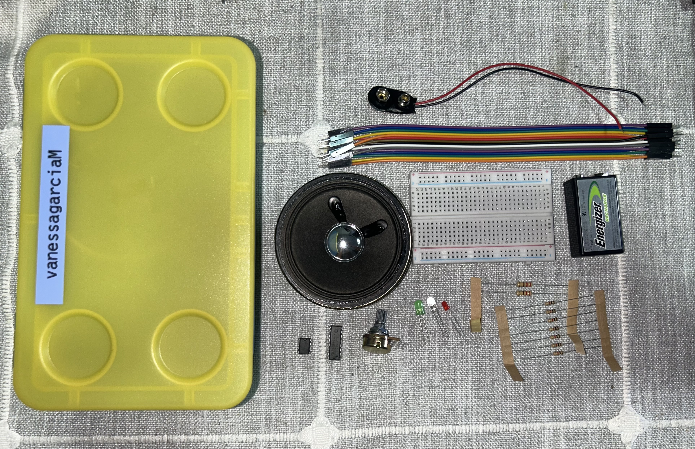
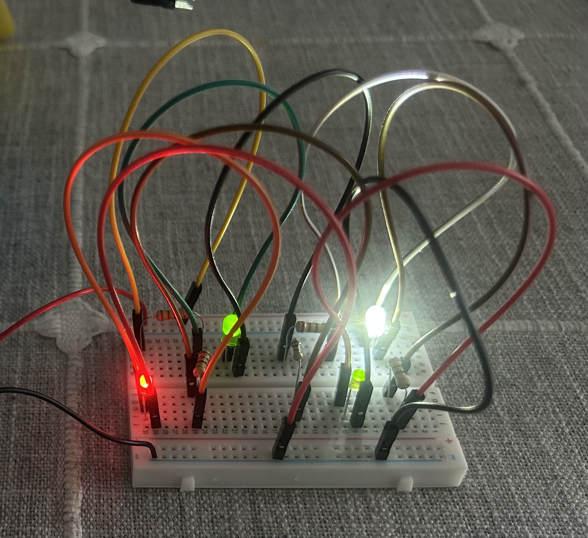
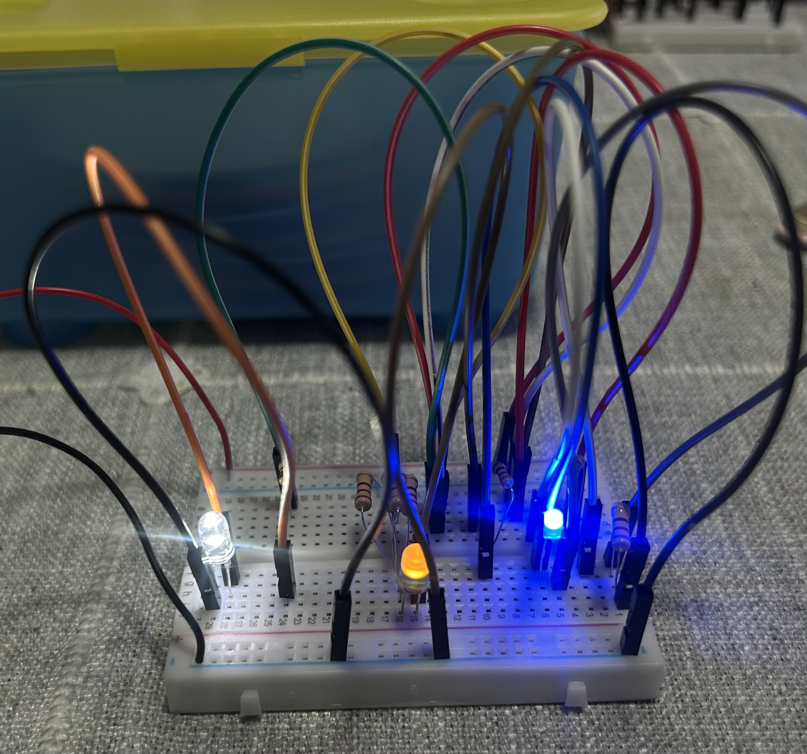
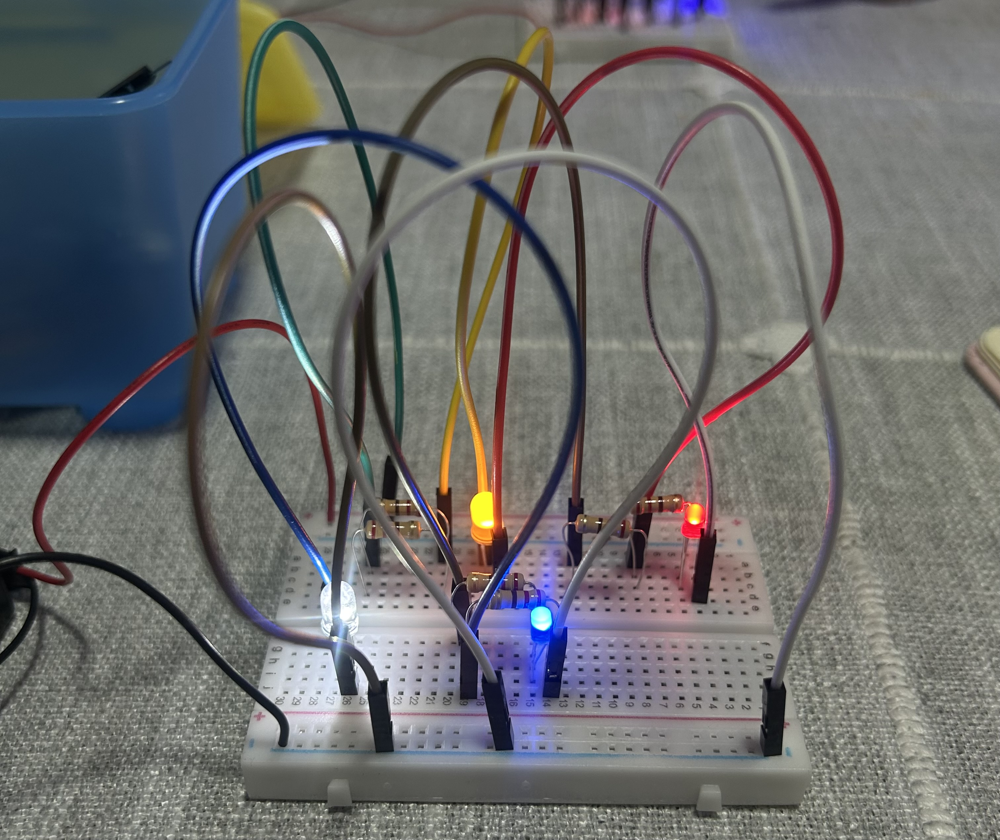
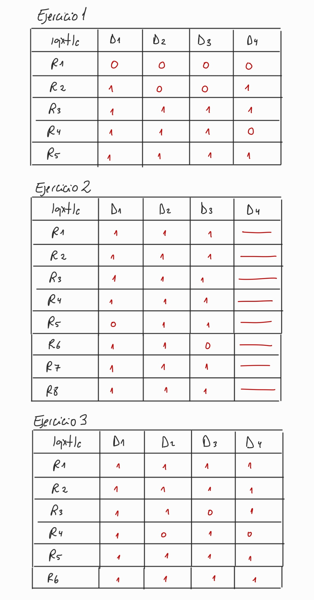
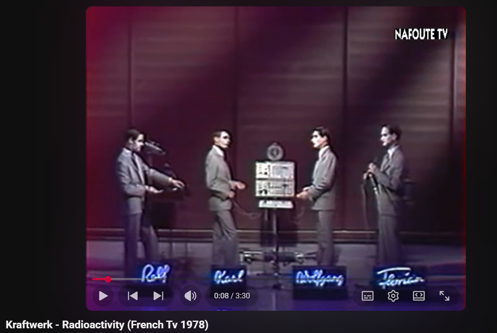
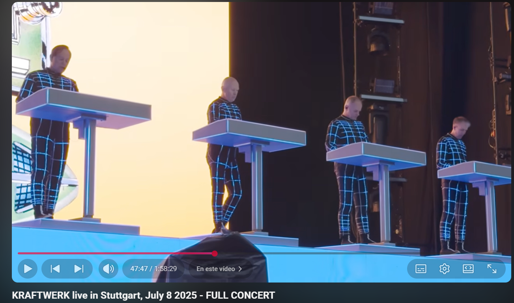
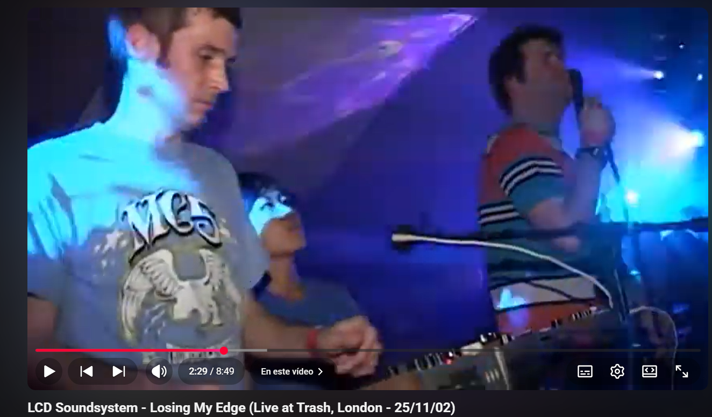
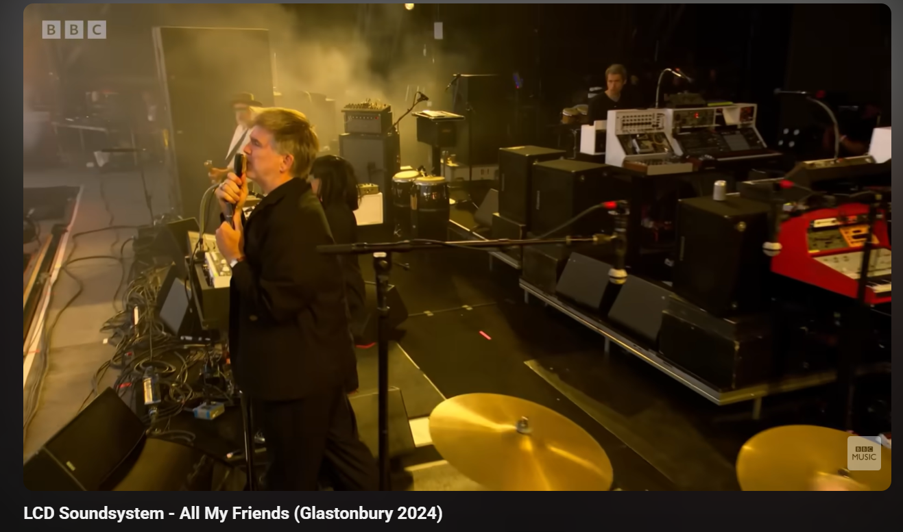

# sesion-02a
___

## Apuntes clase 

Para comenzar la clase, cada uno recibió su kit personal con las herramientas que vamos a usar en las actividades. 

El kit contiene:  

**Pila:** Dispositivo que almacena energía química y la convierte en energía eléctrica para alimentar un circuito. 

**Broche de batería:** Conector que se fija a una batería para extraer energía eléctrica y conectarla a un circuito. 

**Led:** Componente electrónico que emite luz cuando circula corriente eléctrica a través de él. 

**Potenciómetros (B100k):** Los potenciómetros son componentes electrónicos que sirven para regular o ajustar el valor de una resistencia, lo que permite controlar cosas como volumen, velocidad, brillo, etc. 

**Cables Dupont:** Son cables de conexión con terminales en los extremos que permiten unir componentes electrónicos de forma rápida y sin soldadura. 

**Parlante:** Dispositivo electrónico que convierte señales eléctricas en sonido, permitiendo escuchar audio. 

**Chips IC:** Componente electrónico que contiene muchos circuitos en un solo chip, usado para procesar, controlar o amplificar señales. 

**Resistencias:** Componente electrónico que se usa para limitar o controlar el paso de la corriente eléctrica en un circuito. Se mide en ohmios (Ω), que indican cuánta oposición ofrece al paso de la corriente. 

Reconocimos los materiales conductores y aislantes: 

+ **Conductores:** hierro, plata, oro, cobre, aluminio. 

+ **Aislantes:** vidrio, tierra, plástico, madera, cuero. 

¿El aire? Puede comportarse como conductor dependiendo de las condiciones. 

Aprendimos a leer una resistencia. 

**¿Cómo se hace?**

Los dos primeros colores indican los dígitos, el tercero la cantidad de ceros y el cuarto la tolerancia. Según la tabla de colores: 

+ Rojo (2), rojo (2), café (1), dorado (5 %) → 220 Ω 

+ Café (1), negro (0), rojo (2), dorado (5 %) → 1000 Ω 

+ Amarillo (4), violeta (7), naranjo (3), dorado (5 %) → 47 000 Ω 

 
También vimos dos tipos de conexiones 

+ **En serie:** Forma de conectar componentes uno tras otro en un circuito, donde la corriente es la misma para todos los elementos.

+ **En paralelo:** Forma de conectar componentes en un circuito donde todos están unidos a los mismos puntos, por lo que el voltaje es el mismo en cada uno.

 

Conceptos básicos: 

+ GND (Ground): tierra, voltaje cero (0 V) 

+ VCC: voltaje positivo de alimentación 

+ R: resistor 

+ D: LED 

Un circuito eléctrico es un lazo cerrado con al menos un elemento resistivo. 

___ 

### Encargo-02a lqxtlc

Armar esquemas en protoboard y documentar qué ocurre con D al retirar cada R del circuito.

Ejercicio 1

En este ejercicio se observó que, al retirar R1, se apagaban todos los led. En cambio, al retirar R3 y R5, los LED se mantenían encendidos, sin afectar el funcionamiento del circuito.

Ejercicio 2

En este ejercicio se observó que solo R5 y R6 afectaban el funcionamiento del circuito: al retirar R5 se apagaba D1, y al retirar R6 se apagaba D3.

Ejercicio 3

En este ejercicio se observó que solo R3 y R4 afectaban el funcionamiento del circuito: al retirar R3 se apagaba D3, y al retirar R4 se apagaban D2 y D4.

**Resultados tabla lqxtlc** 

___ 

#### Encargo-02a Investigación Bandas Kraftwerk y LCD soundsystem

**Avances de era y contexto de grabación Kraftwerk**

A finales de los años 1970, la música experimentó un cambio decisivo, impulsada por los avances tecnológicos que por primera vez permitieron controlar el sonido con precisión mecánica. En el centro de este cambio estuvo el desarrollo de los sintetizadores: mientras que los sistemas modulares de la década anterior eran inestables y difíciles de operar, los instrumentos de esta era ofrecían una confiabilidad sin precedentes. Esta estabilidad técnica permitió a Kraftwerk trascender los simples experimentos sonoros para crear composiciones melódicas consistentes, utilizando la síntesis no sólo como un efecto decorativo sino como la arquitectura básica de canciones completas y estructuradas. 

La fuerza impulsora detrás de esta nueva estética fue la mejora de los secuenciadores analógicos y las cajas de ritmos. Las secuencias permitieron programar patrones de notas automáticos y precisos, estableciendo la repetición matemática como el lenguaje esencial de la música electrónica moderna. Al mismo tiempo, las primeras cajas de ritmos, aunque todavía primitivas, permitieron generar pulsos constantes sin un baterista humano, reforzando la identidad sonora de "máquina" de la banda. Esta automatización fue la clave para que el ritmo dejara de ser una interpretación variable y se convirtiera en un ritmo constante y sintético. 

La consolidación del concepto “hombre-máquina” alcanzó su máxima expresión sonora a través del vocoder, una herramienta que procesaba la voz humana para darle una textura robótica que desdibuja la línea entre lo orgánico y lo artificial. Al mismo tiempo, el estudio de grabación dejó de ser un simple espacio de grabación para convertirse en un instrumento en sí mismo. El uso creativo de cintas, bucles y efectos por parte de Kling Klang permitió ensamblar piezas complejas capa por capa, brindando a los músicos un control total sobre el resultado final. De esta manera, Kling Klang surgió como un laboratorio creativo donde los experimentos abstractos dieron paso al lenguaje de la música visionaria. Combinando la sensibilidad humana con los rigores de la tecnología, Kraftwerk no sólo definió el sonido de The Man-Machine, sino que también estableció la base técnica y conceptual sobre la que se construiría gran parte de la música actual, desde el techno hasta el pop electrónico global. 

**Referencias** 

Sound On Sound. (2025). Roland MC8. https://www.soundonsound.com/reviews/roland-mc8 

Red Bull Music Academy. (2012). Interview: Kraftwerk. https://daily.redbullmusicacademy.com/2012/08/kraftwerk-interview/ 

**Comparativa entre las actuaciones en vivo antiguas y actuales**

En el video de 1978, la música se veía muy física y directa: los músicos usaban sintetizadores analógicos con consolas llenas de perillas, interruptores y cables a la vista. El sonido era cálido pero minimalista, y cada ritmo se sentía como los engranajes de una máquina industrial. Incluso el vocoder se usaba como un experimento, tratando de darle un efecto robótico a la voz humana, mostrando que todo el proceso dependía mucho del manejo manual y de la precisión de los músicos. 

En la versión de 2025, todo ha cambiado gracias a la informática de alto rendimiento. Los músicos usan estaciones de control digitales elegantes y minimalistas conectadas a un enorme sistema de sonido. Ya no hay cables ni equipos visibles: el sonido se genera en un entorno virtual con una claridad y potencia increíbles, graves profundos y un control total sobre cada detalle. Aunque la interpretación sigue siendo en vivo, ahora la tecnología permite que cada parámetro esté perfectamente ajustado, ofreciendo una experiencia envolvente y precisa que sería imposible con los equipos de 1978. 

**¿qué sentí?**

En el disco The Man-Machine, lo que más me llama la atención son los sonidos robóticos que aparecen de forma intermitente, que dan la sensación de máquinas cobrando vida. Las notas agudas y prolongadas generan momentos de tensión, casi como si estuvieras escuchando un suspenso cuidadosamente calculado. Los ritmos constantes dominan gran parte del álbum, repitiéndose sin muchas variaciones, lo que refuerza la sensación de precisión mecánica y, a la vez, genera expectativa. Hay sonidos que recuerdan a pianos de música de terror que se perciben al fondo, y estos matices crean una atmósfera fría y melancólica; algunas melodías me provocan impaciencia, como si estuviera esperando que el ritmo cambiara o algo inesperado sucediera. A lo largo del disco, se mantiene una sensación de tensión sostenida, una especie de anticipación continua: no transmite tranquilidad, sino que mantiene al oyente en un estado de alerta, con la impresión de que algo está por ocurrir.

**Imágenes**

**Avances de era y contexto de grabación LCD soundsystem**

A mediados de la década de 2000, la música electrónica y alternativa experimentó una transformación caracterizada por la integración de tecnologías digitales avanzadas con instrumentos electrónicos tradicionales. Dirigido por James Murphy, LCD Soundsystem se destacó en la combinación de sintetizadores, percusión programada y producción híbrida para crear piezas estructuradas y emocionalmente expresivas. El uso de estaciones de trabajo digitales y software de producción permitió a la banda manipular con precisión loops, samples y secuencias, creando un sonido que combinaba la repetición mecánica de la electrónica con la sensibilidad humana de la interpretación en vivo. Este enfoque hizo del estudio de grabación un instrumento verdaderamente creativo donde cada capa de sonido podía desarrollarse, modificarse y ensamblarse hasta lograr la complejidad y coherencia de Sound of Silver. Un importante avance tecnológico de esta era fue la flexibilidad de la producción digital, que facilitó la creación de ritmos precisos, la edición de texturas y la combinación de elementos analógicos y digitales en un solo espacio. Tener estas herramientas disponibles permitió a Murphy y su equipo explorar nuevas formas de arreglar canciones y mantener un equilibrio entre la precisión electrónica y la expresión emocional. En este contexto, el trabajo de LCD Soundsystem representa cómo la tecnología pasó de ser una simple herramienta de grabación a convertirse en un motor de creatividad musical, estableciendo estándares de producción que influyeron en la danza contemporánea, la música electrónica y el rock, y consolidando un lenguaje sonoro que integra fluidamente a la humanidad y la máquina. 

**Referencias** 

Red Bull Music Academy. (2013). James Murphy. https://www.redbullmusicacademy.com/lectures/james-murphy 

Reid, G. (2025). A journey through synthesizer history. Sound On Sound. https://www.soundonsound.com/people/journey-through-synthesizer-history

**Comparativa entre las actuaciones en vivo antiguas y actuales**

En el video de 2002, LCD Soundsystem toca “Losing My Edge” en un club pequeño, con James Murphy usando una computadora portátil y un sampler como sus principales herramientas. El sonido es más simple, un poco metálico y experimental, y todo depende de que Murphy controle los ritmos y los loops mientras toca, haciendo que la actuación se sienta íntima y casi casera. 

En cambio, en el video de 2024, la banda interpreta “All My Friends” frente a una enorme audiencia, y la tecnología hace que todo suene mucho más potente y claro. Los sintetizadores modernos, los efectos digitales y los sistemas de mezcla permiten que cada instrumento y voz se escuchen perfectamente, incluso en un espacio para 100.000 personas. Además, los patrones de ritmo y los loops funcionan sin errores, manteniendo la canción precisa y potente durante toda la interpretación. La diferencia no es solo el tamaño del público, sino que ahora la banda puede combinar el caos de tocar en vivo con la precisión de la electrónica, creando un espectáculo mucho más impactante que en 2002. 

**¿qué sentí?**

Al escuchar Sound of Silver, algunas canciones me generan una sensación de energía y motivación, como si me impulsaran a ser productiva o a moverme al ritmo de la música. Los ritmos electrónicos repetitivos y los bajos profundos crean un pulso constante que invita a moverse y a conectar con el ritmo de manera casi física. Otras canciones, en cambio, transmiten tranquilidad y serenidad; su sonido invita a relajarse y disfrutar del momento, como si todo lo demás dejara de importar por un instante. Al imaginar un escenario para estas canciones, se percibe un ambiente más cálido y acogedor, donde la música envuelve suavemente y se siente ligera, transmitiendo la sensación de que no hay preocupaciones. 

**Imágenes**

 

 
