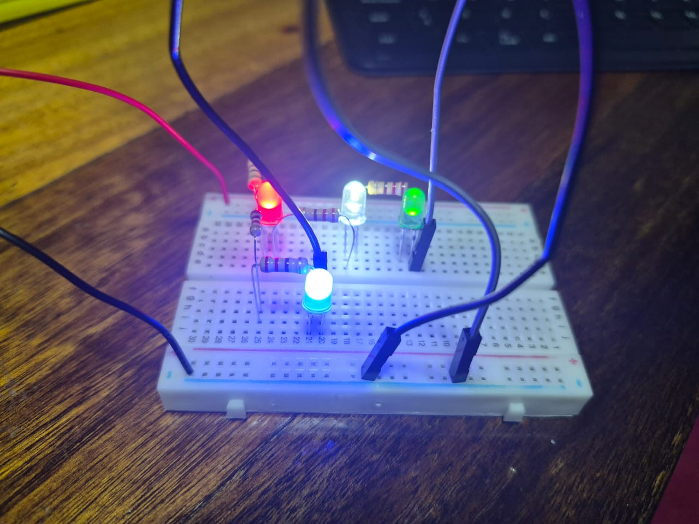
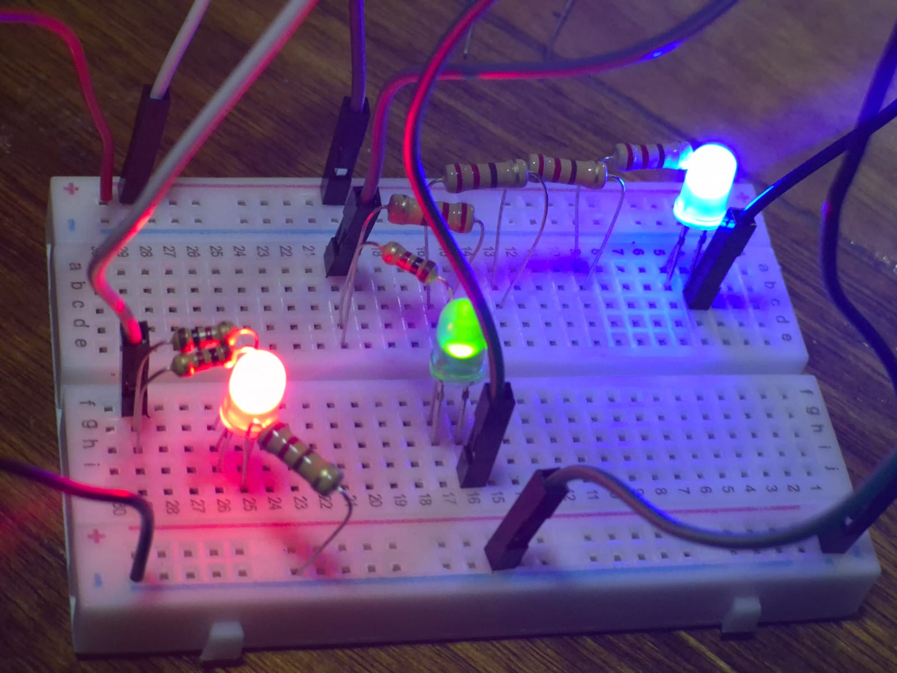
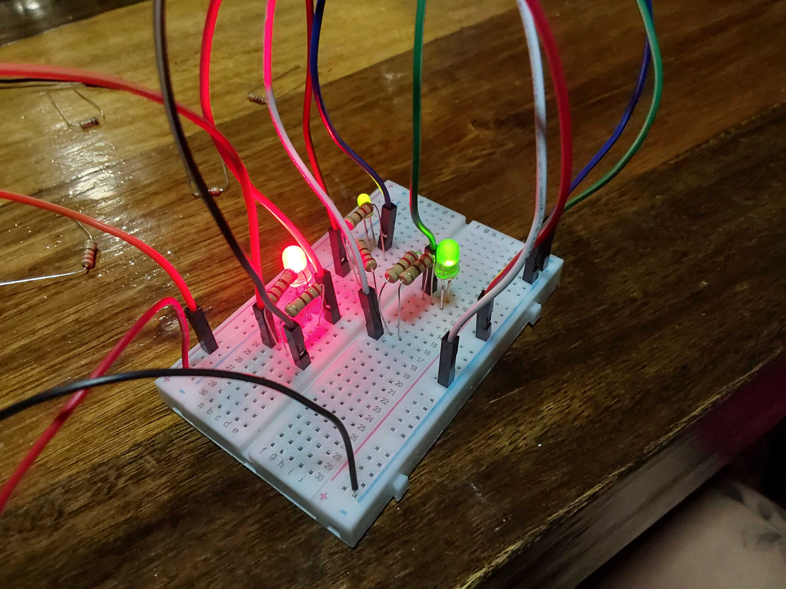

# sesion-02a
# CLASE
+ Las resistencias para saber cuantos OHM posee, se puede saber viendo los colores que estan en franjas las cuales dependiendo del color este tienen un numero.
+ La siguiente imagen es una **tabra de resistencias**, donde nos entrega los numeros por cada color:

## Circuito creado en clases:

## EJERCICIO 01
| loquitoportilocoloco  |  D1   |  D2   |  D3   |  D4   |
| ---                   | ---   | ---   |  ---  |  ---  |
| R1                    |   0   |   0   |   0   |   0   |
| R3                    |   1   |   1   |   0   |   1   |
| R4                    |   1   |   1   |   1   |   0   |
| R2                    |   0   |   0   |   0   |   1   |
| R5                    |   0   |   0   |   0   |   1   |

## EJERCICIO 02
| loquitoportilocoloco |  D1 |  D2 |  D3 |
| -------------------- | --- | --- | --- |
| R1                   |  1  |  0  |  1  |
| R2                   |  1  |  0  |  1  |
| R3                   |  1  |  0  |  1  |
| R4                   |  1  |  0  |  1  |
| R5                   |  0  |  1  |  1  |
| R6                   |  1  |  1  |  1  |
| R7                   |  1  |  1  |  1  |
| R8                   |  1  |  1  |  0  |

## EJERCICIO 03
| loquitoportilocoloco |  D1 |  D2 |  D3 |  D4 |
| -------------------- | --- | --- | --- | --- |
| R1                   |  1  |  1  |  1  |  1  |
| R2                   |  1  |  1  |  1  |  1  |
| R3                   |  1  |  1  |  0  |  1  |
| R4                   |  1  |  0  |  1  |  0  |
| R5                   |  1  |  1  |  1  |  1  |
| R6                   |  1  |  1  |  1  |  1  |

