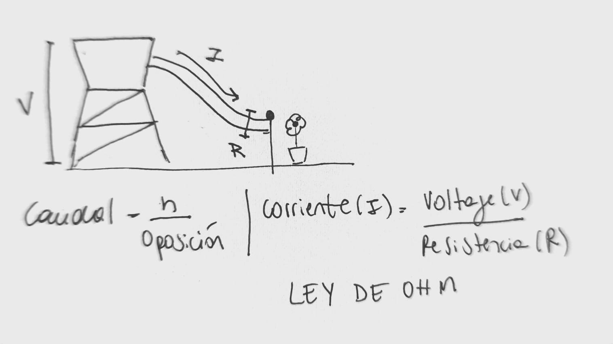
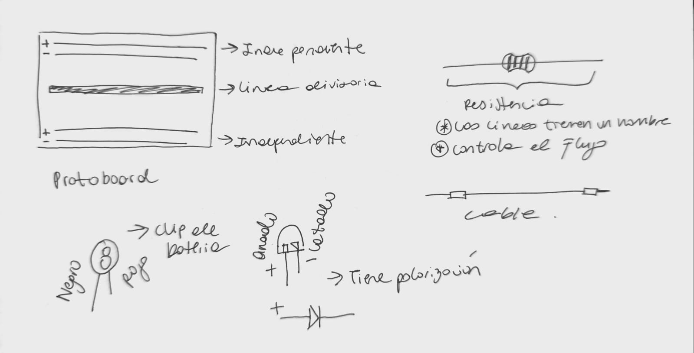
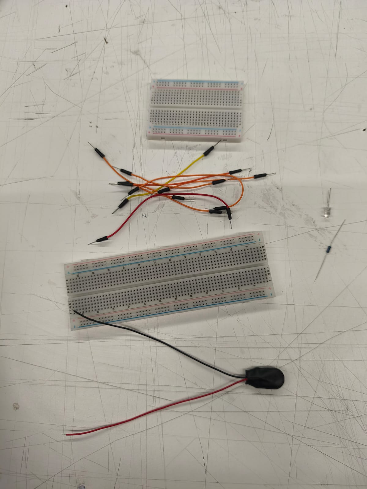
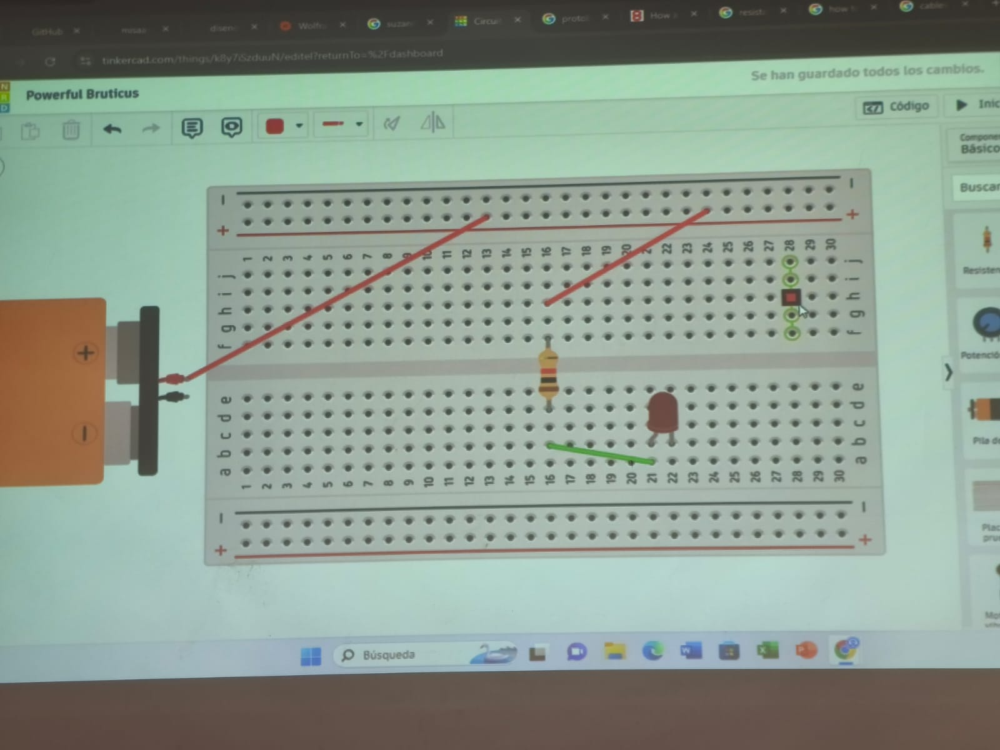
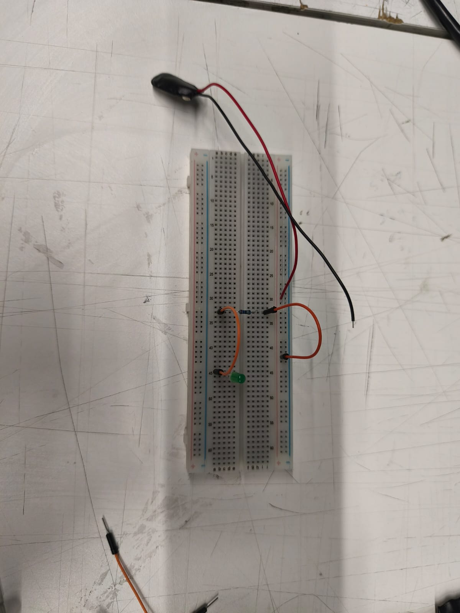

# sesion-01b

## clase 130326

- Suzanne ciani hizo el pop de un comercial de coca cola

- WolframAlpha: calculadora

- Shift+ctrl+r es un refresh duro

### Primera parte: aprender Github

- Fork (bifurcación): tener una copia del repositorio o carpeta. Esto se utiliza pra no destruir el repositorio inicial. El repositorio o carpeta tiene subcarpetas.

- Commits es un compromiso en github

- Cuando se suba una modificación describir con un mensaje corto o dejar el pre establecido.

### Segunda parte: clase misaa

- El broche de bateria tiene un cable rojo que es poder y el negro que es tierra

- Cortocircuito es un circuito corto

- **Palabras claves:** Resistencia, flujo, potencial, corriente, diferencial, poder, ejercía, conducir, carbón, silicio, cobre.

- Know-what es historia. Saber el cómo pasó y el know-how es saber cómo se hicieron las cosas.

- **Caudal:** corriente de agua que pasa por un lugar

- Más oposición al flujo, menos agua. Más oposición al flujo, más agua

- La altura controla la potencia y como cae el agua.
Corriente es cuánta energía pasa. Entre más corriente, más electrones pasan.

- Los electrones son negativos. Es parte del átomo. El cobre tiene un solo de los 29, por eso se hacen cables con ello 

- Diferencia de potencial sinónimo de voltaje

- Entre más resistencia, menos flujo. Entre menos resistencia, más flujo hay.

- La resistencia no tiene polaridad

- Los colores de los cables no tienen orden

- Cables de proto (decir esto cuando quieras comprar) es lo mismo que cable de dupont

- El cable es un punto o un nodo, intersección

- **Resistencia:** limite de velocidad

### imagenes del proceso

## Post clase

Mi hermana me enseño a como ingresar una imagen en github la cual probé en la primera clase, además de aprender sobre cómo jerarquizar de manera no visual como se haría editorialmente y como crear una carpeta

Cómo colocar una imagen: en el repositorio dirigirse a “add file” y apretar upload files, subir tu archivo deseado. Después de ello  

- Análisis y opinión del documental sobre Aaron Swartz

Mi impresión antes de ver el documental completo es que nos enseñaría sobre como invento reddit y como fue evolucionando hasta el día de hoy para ser una plataforma donde mucha gente comparte opciones, noticias, etc, pero me sorprendió que este fuera tan “banal” para la narrativa, ósea, en el sentido que el lo creo, vendió y listo, eso aportó en la narrativa del documental.

Es importante comenzar diciendo quien era el. Aaron Swartz era un joven el cual desde muy pequeño estaba bastante adelantado en todos los ámbitos, aprendía muy rápido, llegando así a programar un preguntas y respuesta de star wars para después realizar a tan solo sus 12 años “ The info” una enciclopedia antes de wikipedia ganando el premio ArsDigita que se le otorgada a jóvenes que crean sitios web no comerciales.

El mundo de Swartz estuvo lleno de programación, grandes de esa época se le acercaban y escuchaban sus opiniones como lo era Lawrence Lessig quien confió en él hasta el final de que nada de lo que hacía estaba mal. 

Como dije antes, pense que seria un documental sobre cómo el desarrollo reddit, después sus creaciones y colaboraciones a la programación e internet, pero jamás esperé que sucediera lo que sucedió, que alguien tuviera que arriesgar todo hasta su vida para que recién se dieran cuenta de lo que sucedía y que otros tuvieran que tomar el relevo después ¿por qué debemos llegar a esos extremos? 

A ver, si tu no estas escondiendo nada ¿por qué te aterras de una persona que desea toda la información que debería ser de dominio público y entregarla al mundo? ¿es por eso que quieres que otros testifiquen en contra de él? Desde ese punto todo me parecía bastante extraño. Soy una persona 0 política, pero esto me hace pensar en muchas cosas y que alguien tenga que arriesgar su vida por la presión y miedo de otros. Por favor, un poco de conciencia humana. 

Entonces quiero volver a recalcar el ¿por qué alguien se debe sacrificar hasta su vida para que recién las cosas sucedan como deben? para mi hasta el día de hoy no lo entiendo.

(Quiero decir que me ha costado un poco aprenderme los nombres de todo, no me acuerdo de ninguno, las siglas me cuestan mucho, pero voy de a poco!)
