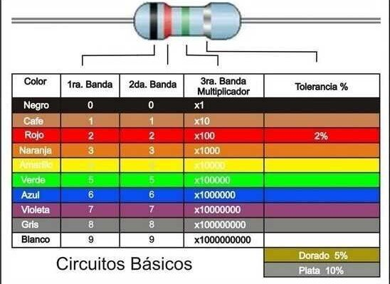
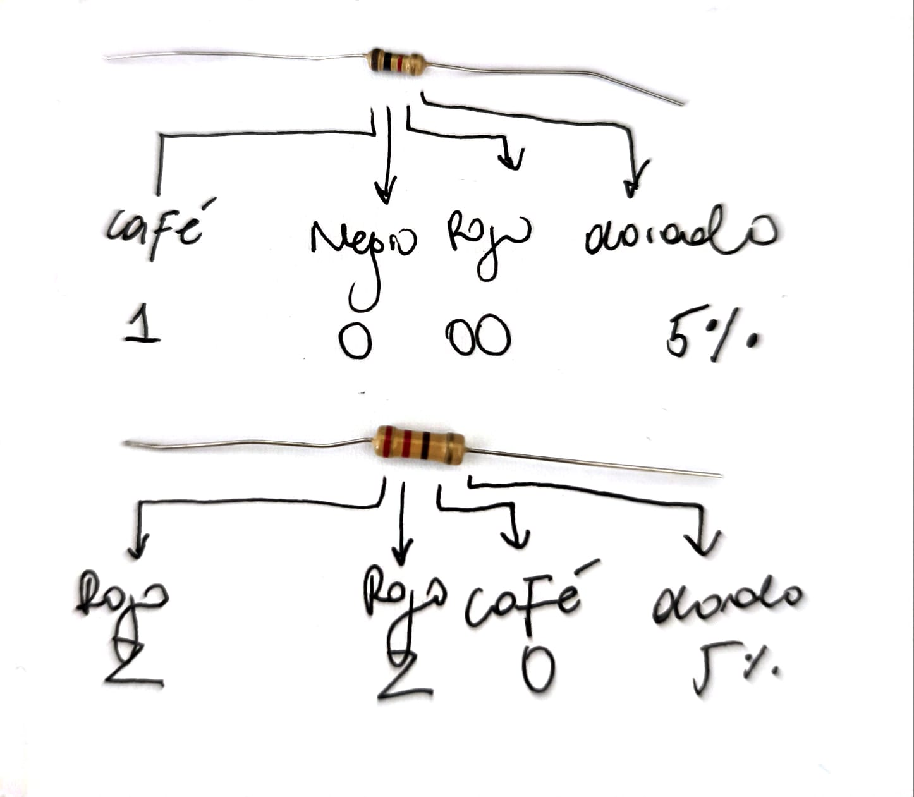
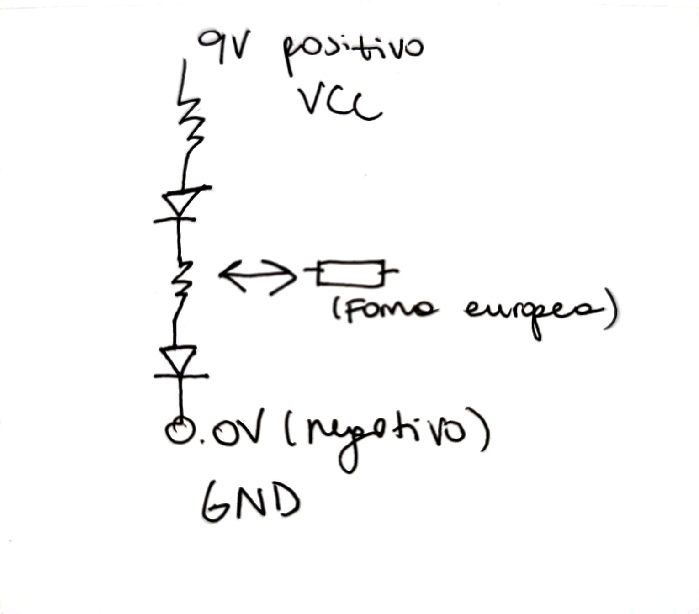

# sesion-02a

## Clase 170326

### pre-clase (teloneo Aaron)

Referentes entregados

1. Kraftwerk
2. LCD Soundsystem
3. Pierre Shaeffer: Tratado de los objetos musicales (1966)
4. Hainboch
5. Oficina de la nada (Felipe Cussen)

Fabricar androides es la música electrónica.

El sonido comienza y decae. 

### clase

- Primera parte: Aaron 

Primero observamos y analizamos cada elemento que se nos otorgó en cada caja

**Potenciómetro:** Existen los A y B. Los B son económicos, en cambio los A son caros y se utilizan en audio. 

Existen dos tipos de cables dupont: Dupont dupont y dupont caimán.

**CHIP IC:** Se colocan sobre el surco de la podroboard. Contienen un circuito interno. Nos ayuda a realizar secuencias con ritmo. Esta pieza en las “patitas” externas tienen un surco el cual nos ayuda a saber dónde comienza.

Se crearon primero las luces verdes y en la actualidad recién podemos ver luces azules ya que son más difíciles de realizar. 

Los parlantes de bajo son mucho más grandes ya que el oído humano es más susceptible a ello, en cambio los agudos no y cada vez los escuchas menos. 

- Segunda parte: Misaa

**Resistencia electrónica:** están realizadas con carbón por su alta cantidad de OHM

El cobre tiene 0,075 Ω de resistencia, le cuesta más que al oro pasar los electrones y el oro tiene 0,022 Ω de resistencia.

La resistencia debe estar conectado a 2 lugares distintos de la protoboard

No existe ningún material que no tenga resistencia. Los científicos han realizado experimentos para bajar la resistencia, pero están adulterando los elementos. 

Las resistencias tienen un codigo de color ya que a traves de este metodo podemos saber cuanta resistenbcia tiene. Nosotros en nuestro caso tenemos de 220 Ω y 1k

1. Los dos primeros colores son digitos (estos entregados a partir de una tabla que contiene estos datos) 
2.  La tercera barrita son la cantidad de 0 que tiene
3.  El color dorado es el margen de error o tolerancia.

Calculadora de resistencia https://www.digikey.com/es/resources/conversion-calculators/conversion-calculator-resistor-color-code 

Electrodos: aplicación para teléfono

**Esquemático:** Representan de manera gráfica y abstracta el circuito

**Circuito paralelo:** son independientes

**Circuito:** Lazo cerrado con elementos resistivos Fluye la electricidad mediante elementos

**VCC:** voltaje de corriente cotidiana

**GND:** ground, 0V, tierra, voltaje negativo

Read me es un archivo, no una carpeta

Mucho de las cosas que hacemos es por sentir algo (aaron)

### imagenes de proceso

.

### post-clase

1. Cada resistencia debe existir un cable
2. La resistencia debe ir en la misma línea que el cable y el lado positivo del led en vertical
3. Todo debe ir en la misma linea
4. Coloque otro circuito, pero de manera equivocada y la luz del primer circuito fallaba

- Analisis artistas
- Ejercicios

