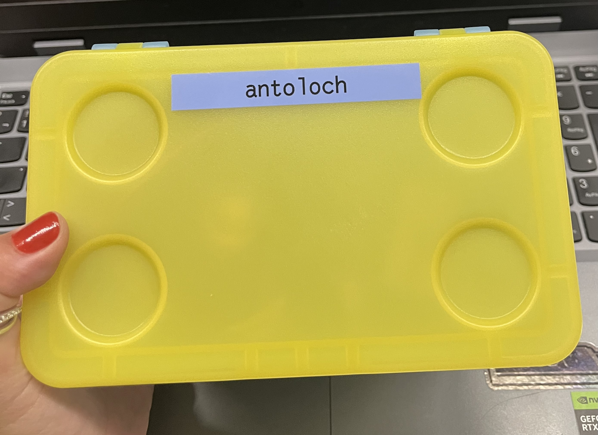
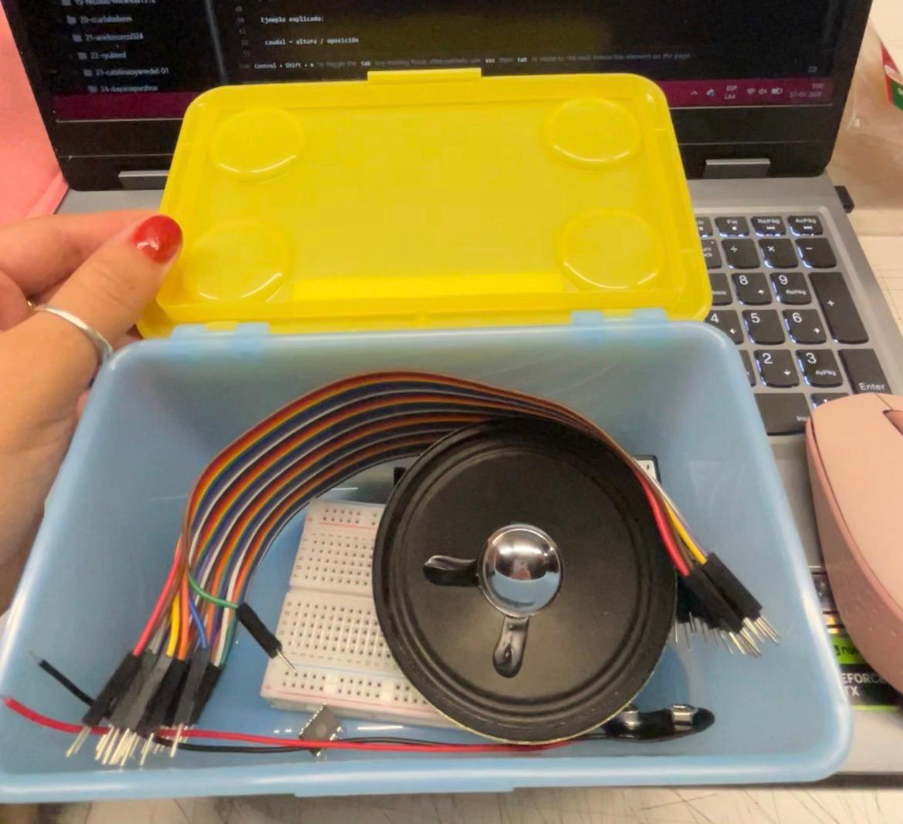
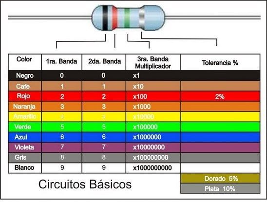

# sesion-02a
# Pierre Schaeffer 

- El sonido se estudia como un objeto
- No importa de dónde viene, sino cómo se escucha
- Base de la música concreta

# Entrega de herramientas
nos entregaron cajas con varias herramientas, que usaremos siempre:

## Potenciómetro
- Sirve para regular
- Hay muchos tipos
- Ej: B100K

## Conectores
- Cables dupont
- Caimán
- Usar colores para:
  - ordenar
  - poder leer con claridad

## Parlantes
- Generan sonido desde la electricidad
  

## Chips (ej: CD4017BE)

- Son simétricos
- Tienen las mismas patas a cada lado
- Se ponen:
  - un lado a un lado del protoboard
  - el otro al otro lado

Sirven para:
- contar
- hacer secuencias

## Broche de batería
- Conecta la batería al circuito

## Spectrum visible light
- Es el espectro de luz visible

# Resistencia eléctrica
Un material se opone al paso de la electricidad

- Cable más largo → más resistencia
- Más chico el área → más resistencia
- Más grande el área → menos resistencia

## importante

Todo material se resiste

No existe (normalmente) resistencia 0

- Cobre conductor → resistencia aprox: 0,075
- Carbón → resistencia: 100 – 1000

---

## Ejemplo para entender

Electricidad = agua  
Material = tubo  

- Tubo ancho → pasa fácil → poca resistencia  
- Tubo angosto → cuesta → mucha resistencia  

Siempre hay algo de resistencia

---

## Clasificación

### Conductores
- Hierro
- Plata
- Oro
- Cobre
- Aluminio
- Aire (pero en ciertas situaciones)

### Aislantes
- Vidrio
- Tierra
- Plástico
- Madera
- Cuero

Importante:  
No es que unos conducen y otros no,  
sino que unos resisten poco y otros resisten mucho

## Datito

- El cuerpo humano tiene resistencia
- El aire puede conducir electricidad en ciertas condiciones (como los rayos)

# Ley de Ohm

V = I × R  
I = V / R  

# Código de color de resistencia

DORADO = TOLERANCIA (5%)

## Cómo leer una resistencia

- Primer color → primer número  
- Segundo color → segundo número  
- Tercer color → cantidad de ceros  
- Cuarto color → tolerancia  

## Ejemplo 

### Rojo – Rojo – Café – Dorado

- Rojo = 2  
- Rojo = 2  
- Café = 1 cero  
- Dorado = 5%  

Resultado: 22 + 1 cero → 220 Ω

### Café – Negro – Rojo – Dorado

- Café = 1  
- Negro = 0  
- Rojo = 2 ceros  
- Dorado = 5%  

Resultado: 10 + 2 ceros → 1.000 Ω (1kΩ)

### Amarillo – Violeta – Naranjo – Dorado

- Amarillo = 4  
- Violeta = 7  
- Naranjo = 3 ceros  
- Dorado = 5%  

Resultado: 47 + 3 ceros → 47.000 Ω (47kΩ)

## tipicos influencers
- 1.000 = 1k  
- 10.000 = 10k  

## colores

Los colores funcionan como un código:
te dicen el número y cuántos ceros tiene la resistencia

# GitHub

Cómo agregar imágenes:

- Sin mayúsculas
- Sin espacios (usar -)

# Conceptos de circuito

## Circuito paralelo
En un circuito paralelo, la corriente tiene varios caminos, por lo que los componentes funcionan de forma independiente y el voltaje es el mismo en cada uno.
## Símbolos

- GND → Ground (tierra)
- VCC → voltaje de alimentación / corriente continua
- R → resistencia
- D → LED
