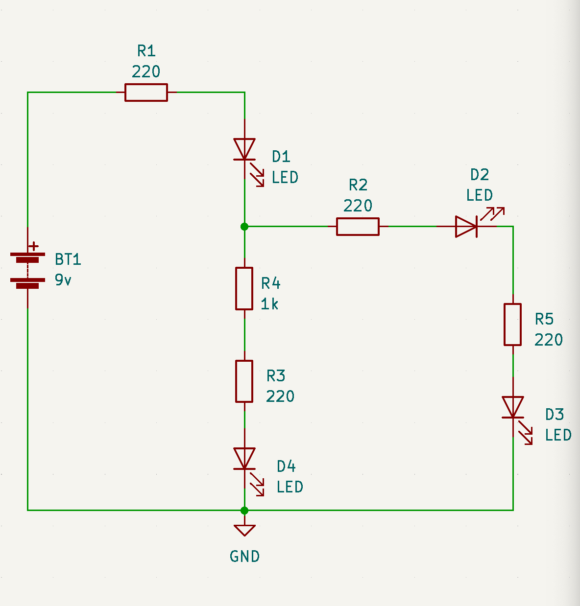

# sesion-02a 17.03

## Materiales

- **Potenciómetro B100k:** Mide la potencia. Según gemini es una resistencia variable de 100kΩ (100.000 ohmios) con un comportamiento lineal. La letra "B" indica que el cambio de resistencia es **constante y proporcional al giro de la perilla**, ideal para controlar voltajes en circuitos de Arduino, intensidad de luz o tono, con 3 pines de conexión.

- **Chip ic:** Se ponen entorno al eje céntrico de la proto (tiene transistores dentro). Empieza donde tiene la mordida.

- **Chip CD4017BE:** Según gemini es un circuito integrado CMOS de 16 pines que funciona como c**ontador divisor de décadas** (contador Johnson) con 10 salidas decodificadas. Es muy popular en electrónica para secuenciar luces, sintetizadores y aplicaciones de conteo, contando cada pulso de reloj y activando sus salidas secuencialmente de la **Q0 a la Q9.**

- **Resistencias:** Es la oposición que presenta un material al flujo de corriente (electrones) en un circuito. Se mide en ohmios (Ω) y depende de la resistividad del material, la longitud del conductor y su área transversal.**A mayor resistencia, menor corriente pasa**, generando calor como efecto secundario. - **Cobre:** 0,075, **Carbón:** 100-1000, **Oro:** 0,022

  _Voltaje es igual a corriente por resistencia_
  
  _corriente es igual a voltaje dividido por resistencia_
  

[Calculadora de colores de resistencias](https://www.digikey.com/es/resources/conversion-calculators/conversion-calculator-resistor-color-code)

| Color 1 | Color 2 | Color 3  | Color 4 | Resultado |
| ------------- | ------------- |------------- | ------------- | ------------- |
| Rojo: 2 | Rojo: 2  | Café: 1| Dorado: Tolerancia | 22 0} 1 cero  |
| Café: 1 | Negro: 0 | Rojo: 2 | Dorado: 5% | 10 00} 2 ceros  |
| Amarillo: 4 | Violeta: 7 | Naranja: 3| Dorado| 47 000} 3 ceros  |

## diferentes circuitos

**Circuito eléctrico:** Lazo cerrado que pasa por elementos resistivos

- **Circuito paralelo:** Son indepencientes. Según Gemini es una configuración donde los componentes (resistencias, bombillas) comparten los mismos nodos de entrada y salida, creando caminos independientes para la corriente. El voltaje es igual en todos los componentes, mientras que la corriente total se divide entre las ramas. Si uno falla, los demás siguen funcionando.

- **Circuito en serie:** Según gemini es una configuración eléctrica donde los componentes (resistencias, bombillas, etc.) se conectan uno tras otro, creando un único camino para la corriente eléctrica. La intensidad de corriente es constante en todo el circuito, mientras que el voltaje total se distribuye entre los componentes y la resistencia total es la suma de las individuales.

## Encargo: LQXTLC

Armar estos esquemáticos en su protoboard. Documentar que pasa con cada D si retiro cada R. Nombra el apagado como "0" y el encendido como "1".

Ejemplo: Si quito "R5", solo se apaga "D3". El resto se mantiene encendida.

### Ejercicio 1

| reesistencias  | D1    | D2    | D3    | D4    |
| ---                   | ---   | ---   | ---   | ---   |
| R1                    |    0  |   0   |    0  |    0  |
| R3                    |    1  |   1   |    1  |   0   |
| R4                    |    1  |   1   |   1   |  0    |
| R2                    |    0  |   1   |  1    |   0   |
| R5                    |    0  |   1   |  1    |   0   |

### Ejercicio 2

| resistencias | D1 | D2 | D3 |
| -------------------- | -- | -- | -- |
| R1                   |  1 |  0 |   1|
| R2                   |  1 | 1  |  1 |
| R3                   | 1  | 0  |  1 |
| R4                   | 1  |  0 |  1 |
| R5                   |  0 |  1 |  1 |
| R6                   | 1  |  1 |  1 |
| R7                   | 1  | 1  |  1 |
| R8                   | 1  |  1 |  0 |

### Ejercicio 3

| resistencias | D1 | D2 | D3 | D4 |
| -------------------- | -- | -- | -- | -- |
| R1                   |  1 | 1  | 1  |  1 |
| R2                   |  1 |  1 |1   |  1 |
| R3                   | 1  |  1 |  1 |  0 |
| R4                   |  1 |  0 |  1 |  1 |
| R5                   | 1  |  1 |  1 | 1  |
| R6                   |  1 |  1 |  1 |  1 |

