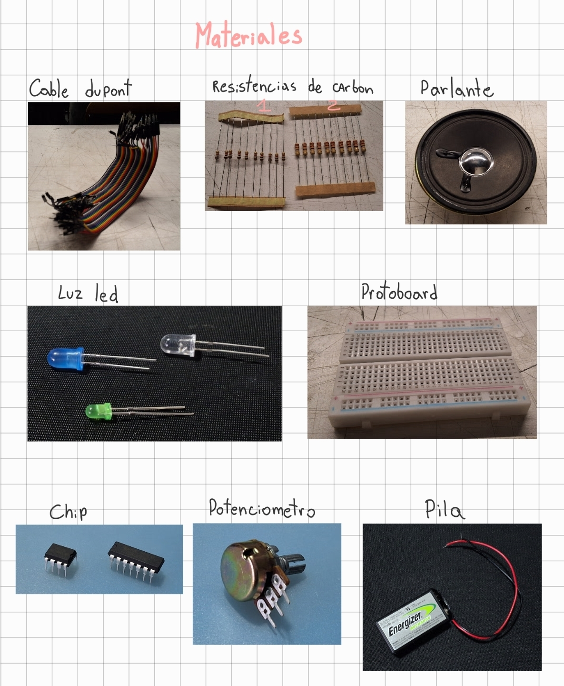
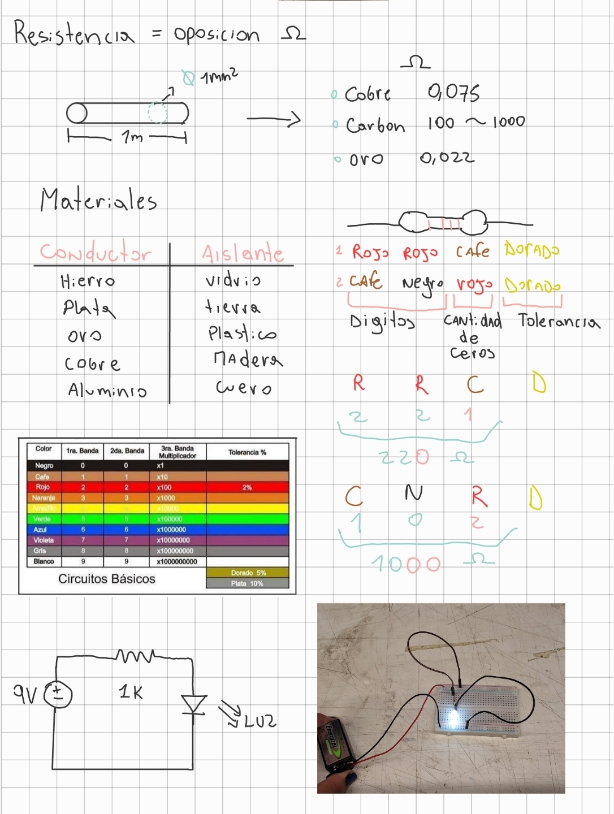

# sesion-01b
---
## Aaron Swartz

Aaron Swartz (1986–2013) fue un programador, escritor y activista político estadounidense. Es reconocido mundialmente como uno de los arquitectos de la internet abierta. Su enfoque no fue el enriquecimiento personal, sino la creación de herramientas que permitieran el libre flujo de información y la democratización del conocimiento.

### ​Contribuciones Tecnológicas Principales
​Swartz participó en la creación de estándares y plataformas que hoy son fundamentales para el funcionamiento de la web:

+ ​RSS (Really Simple Syndication): Con solo 14 años, coescribió el código que permite recibir actualizaciones automáticas de blogs y podcasts.
+ ​Reddit: Como parte del equipo fundador, ayudó a programar la arquitectura original y el sistema de votación de la comunidad.
+ ​Markdown: Co-creó este lenguaje sencillo que permite escribir texto con formato (negritas, títulos) de forma fácil para la web.
+ ​Creative Commons: Colaboró en el desarrollo de las licencias que permiten compartir obras legalmente de forma gratuita.

### ​Activismo y Conflicto Legal
+ ​El motor principal de Swartz fue el Acceso Abierto (Open Access). Su premisa era que el conocimiento científico no debía estar bloqueado por muros de pago
+ ​El incidente del MIT: En 2010, descargó masivamente artículos académicos de la base de datos JSTOR usando la red del MIT
+ ​Consecuencias legales: Aunque no vendió los documentos, la fiscalía de EE. UU. lo procesó bajo la Ley de Fraude y Abuso Computacional (CFAA), amenazándolo con hasta 35 años de prisión. Esta presión legal culminó en su suicidio a los 26 años.

### Legado e Impacto Actual
+ ​Protección contra la censura: Fue clave para detener la ley SOPA, evitando que el gobierno pudiera bloquear sitios web arbitrariamente
+ ​Ciencia Abierta: Su caso impulsó el movimiento para que las investigaciones médicas y científicas sean de libre acceso
+ ​Ética Digital: Es el máximo referente de que la tecnología debe empoderar al ciudadano, no solo servir al control corporativo
  
Aaron Swartz fue un visionario que construyó las herramientas básicas de la comunicación moderna y sacrificó su libertad por defender el derecho universal al conocimiento.

Fuentes y Referencias 

+ https://www.youtube.com/watch?v=M85UvH0TRPc 
+  ​http://www.aaronsw.com/weblog
+ ​Creative Commons: Sitio oficial de las licencias que él ayudó a programar
+ ​Demand Progress: La organización de activismo que Aaron fundó para luchar contra la censura en internet.
---
## Apuntes
Hoy en clases nos entrgaron varios materiales para trabajar en circuitos, aqui un listado de los materiales y su funcion:

+ Cable Dupont: Son cables flexibles con conectores en los extremos que sirven para unir componentes en una placa de pruebas sin necesidad de soldar. Son el "pegamento" que comunica todas las piezas de tu proyecto.
+ Resistencia de carbon: Es un componente que limita el paso de la corriente eléctrica. Sirve para proteger otros materiales (como los LED) para que no se quemen al recibir demasiada energía.
+ parlante: ​Es un transductor que convierte señales eléctricas en ondas sonoras. Sirve para que tu proyecto emita sonidos, tonos de alerta o música simple.
+ Luz led: Es un diodo que emite luz cuando la electricidad pasa a través de él. Sirve como indicador visual (encendido/apagado) o para iluminación básica, consumiendo muy poca energía.
+ Protoboard: Es una placa con muchos orificios interconectados internamente. Sirve para armar y probar circuitos de forma temporal: insertas los componentes y cables DuPont en ella sin usar soldadura.
+ Chip: Es una pastilla de silicio que contiene miles de componentes diminutos en su interior. Sirve para realizar funciones complejas (como procesar datos o amplificar sonido) en un espacio muy reducido.
+ Potenciómetro: ​Es una resistencia variable. Sirve para que tú puedas controlar manualmente la intensidad de algo, como subir el volumen de un parlante o variar el brillo de una luz LED al girar su perilla.
+ Pila: ​Es un dispositivo que convierte energía química en eléctrica. Sirve como la fuente de energía (el "alimento") para que tu circuito pueda funcionar sin estar conectado a un enchufe.
  

### apuntes escritos en clases

