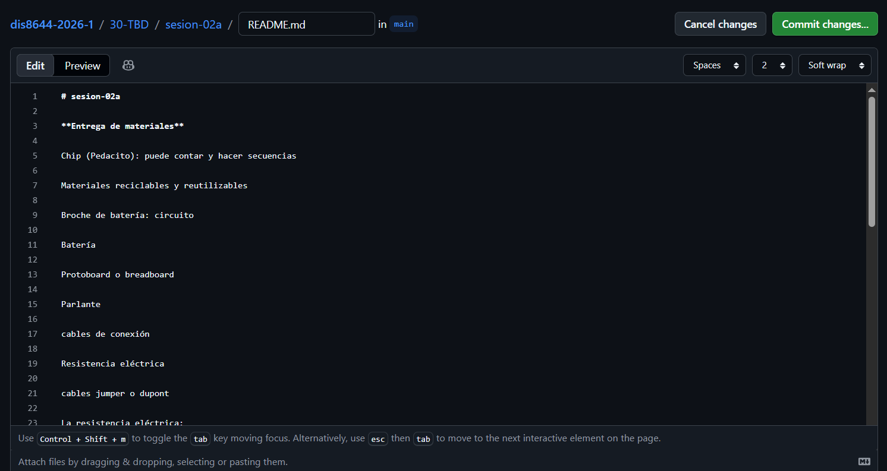

# sesion-02a

**Entrega de materiales**

Chip (Pedacito): puede contar y hacer secuencias 

Materiales reciclables y reutilizables

Broche de batería: circuito

Batería

Protoboard o breadboard

Parlante

cables de conexión

Resistencia eléctrica (se grafica como cuadrado en modo europero y como ondas en gringo pero es lo mismo)

cables jumper o dupont

La resistencia eléctrica:

Se mide en OHM

Hay tablas que muestran que tan resistivo es un material

Material conductor y aislante como el cobre que en su caso se resiste muy poco

Conductor:

Hierro, pata, oro, cobre, aluminio

Cobre: 0,075

Carbón: 100-1000

oro: 0,022

Omega por (mm) al cuadrado dividido en (m)

Aislante:

vidrio, tierra, plástico, madera, cuero

¿AIRE?

## Colores de la Resistencia: se leen para un lado

Rojo, Rojo, Café y Dorado

Café, Negro, Rojo y Dorado

Por lo general estas terminan en dorado y los colores están asociados a un número

Los primeros 2 colores son dígitos literales

el tercero multiplica cantidad de ceros en múltiplos de 10 osea (x10)

Tolerancia

Rojo: 2, Rojo: 2, Café: 1 (Este tercero solo es la cantidad de ceros al final), Dorado: tolerancia del 5% que es el margen de error

22(0) (Los números de los colores son por los que están en la tabla)

Café: 1, Negro: 0, Rojo:2 (dos ceros) , Dorado 5%

1.0(00) = 1.000

Ej: Amarillo: 4, Violeta: 7, Naranja: 3 (tres ceros) , Dorado 5%:

47.(000) = 47.00

sugerencia de descargar la app Electrodos que dice que número de resistencia es dependiendo de los colores que tenga 

Vamos a hacer un nuevo circuito

La resistencia tiene que estar en dos partes distintas

el cable positivo va a la resistencia que en este caso es de 1k osea (Café, Negro, Rojo y Dorado) y en este caso especifico va el led lo pusimos en la misma linea de la resistencia lo que hace que ocupemos menos un cable y la parte negativa del led en el protoboard se conecta a la linea horizontal larga negativa

---

Version branch es una de desarrollo donde proximamente se puede agregar a la version original del Github (La idea es solo tener 1 branch por persona que sería  la "main")

---

la imagenes que devemos poner: sin espacio, sin tildes, sin mayusculas y la manera de subirlas es 

                                                                                             el texto puede tener espacio  nombre del archivo exacto

osea:

es_ 

## Circuito

Un circuito es un lazo cerrado

Un circuito electrico es un lazo cerrado con elementos resistivos 

si se saca la resistencia de 1 de 2 leds se apaga porque se rompe el circuito

**Componentes tienen un nombre: R1 y R2, D1 y D2**

ese circuito tiene 9 volts, solo se nesecita 9 volts en el positivo y 0 volts en el negativo pero no importa como esté fisicamente mientras se cumpla con 

osea que si quito R1 del D1 sique prendido el R2 del D2 porque solo se quitó el cicuito del D1

(IMAGENES DE CIRCUITOS)

A 0 volts se le llama Ground o Tierra o suelo

En los esquemas Ground es el mismo aunque esté escrito en distintos puntos

VCC **voltaje positivo** manera conceptual de decir voltaje de alimentacion (Corriente continua)

GND Ground 0 volts Tierra **voltaje negativo**

## encargo-02a

1. hacer los ejercicios anteriores y documentar los resultados.
2. elegir un disco particular de Kraftwerk, investigar avances de esa era, contexto de grabación, revisar presentaciones en vivo de esa época y contrastar con actuales. explicar qué escuchas en el disco, qué te llama la atención, describir en largo, no en corto.
3. lo mismo que 2 pero con un disco de LCD Soundsystem.

---

### Desarrollo encargo

### Ejercicio 1

## Componentes usados

+ 3 resistencias 220

+ 1 resistencia 1k

+ 5 jumpers

+ Alimentacion

+ 4 leds

| loquitoportilocoloco  | D1    | D2    | D3    | D4    |
| ---                   | ---   | ---   | ---   | ---   |
| R1                    |   0    |   0    |    0   |   0    |
| R2                    |    0   |   0    |   0    |    0   |
| R3                    |    1   |   1    |    0   |   1    |
| R4                    |    1   |   1    |   1    |   0    |
| R5                    |    1  |   1   |  1    |  0   |

### Ejercicio 2

## Componentes usados

+ 4 resistencias 220

+ 4 resistencia 1k

+ 7 jumpers

+ Alimentacion

+ 3 leds

| loquitoportilocoloco | D1 | D2 | D3 |
| -------------------- | -- | -- | -- |
| R1                   |  1  |  0  |  1  |
| R2                   |  1  |  0  |  1  |
| R3                   |  1  |  0  |  1  |
| R4                   |  1  |  0  |  1  |
| R5                   |  0  |  1  |  1  |
| R6                   |  1  |  1  |  1  |
| R7                   |  1  |  1  |  1  |
| R8                   |  1  |  1  |  0  |

### Ejercicio 3

## Componentes usados

+ 6 resistencias 220

+ 4 jumpers

+ Alimentacion

+ 4 leds

| loquitoportilocoloco | D1 | D2 | D3 | D4 |
| -------------------- | -- | -- | -- | -- |
| R1                   |  1  |  1  |  1  |  1  |
| R2                   |  1  |  1  |  1  |  1  |
| R3                   |  0  |  0  |  0  |  0 |
| R4                   |  1  |  1  |  1  |  1  |
| R5                   |  1  |  1  |  1  |  1  |
| R6                   |  1  |  1  |  1  |  1  |

**(Colaboré con mi compañero Tomás Catrileo para desarrollar esta parte del encargo)**

## Desarrollo encargo parte 2

Avances para la epoca (1975) en Disco Kraftwerk - Radioaktivität (Full Album) *radio-activity* es que fue el primero completamente electronico de Kraftwerk.

Estaba en un punto donde la tecnología emepzó a reemplazar completamente a los humanos y los instrumentos tradicionales por tecnológicos, se implementaron varios elementos que llaman la atención y hasta el día de hoy se siguen usando con las mejoras respectivas como los sintetizadores, vocoders y percusión electrónica. Además de la producción independiente se su estudio Kling Klang que permitió crear un sonido totalmente nuevo con el enfoque central del disco en la energia nuclear y la radio, que muestran lo interesados que estaban por los avances tecnologicos de esta epoca. Y estos sonidos no solo marcaron el albúm sino que también marcaron las bases de la música electrónica moderna.

Esto tuvo influencia de Alemania post guerra como con el orden, frialdad, tecnología y orden con sonidos minimalistas y repetitivos como los de un robot con presición mecanica, en las presentaciones en vivo antes eran muy estáticos como sin cambio de imágen robotica y sin interacción con el público en cambio ahora existen visuales 3D con alteración de escenario o que la imagen juegue con la estructura del escenario con shows mas inmersivos y de interación con el publico y el uso de tecnología moderna como camaras, drones, luces de mayor calidad para comodidad del espectador.

En el disco escucho como golpes ritmicos y mecanicos, sonidos de televisor antiguo, voces con cambios radicales y muy duros en su hablado, estática, instrumentos y melodías con las que se pueden sentir mas agradebles algunos momentos y otros mas tensos como de aburrimiento dependiendo de los agudos y graves con repeticion, mezclas de ritmos de fondo con resultados al azar que tiran las maquinas en su estado natural, como si se rayaran algunos discos y efectos como si actualmente se pusieran filtros de voz o de sonido.

Me recuerda a videojuegos tipo 8 bits o juegos pixelados en 2D como terraria y bastante cercano a las canciones de daft punk.

## Desarrollo encargo parte 3

Un avance significativo en este disco: Sound of Silver – Avances para la época (2007), sería el punto de como se mezcla lo electrónico con lo humano, ya que a diferencia de Kraftwerk, que se inclinaba hacia conseguir un sonido más mecánico, LCD Soundsystem logra combinar sintetizadores, instrumentos como la batería o el bajo, generando una sensación de que la música se siente.

En ese momento, ya había más acceso a la tecnología digital, que permitió el trabajo con software de grabación junto a mesas de mezclas analógicas, obteniendo así un sonido híbrido que conjuga lo clásico con lo moderno. Con esto además se tuvo presente el uso de estructuras más repetitivas, propias de la música electrónica, pero con más modificaciones y cambios en las que las canciones no sean mecánicas.

También destaca que el proyecto está muy marcado por la visión de James Murphy, quien tira más a las canciones desde un punto de vista emocional, más personal, propio de una música que no era tan habitual en la electrónica más anterior. Las letras y la forma de cantarcomo tal, aportan así una sensación más humana, más imperfecta más cercana.

Por último, el disco muestra cómo a finales de la década de los noventa la música electrónica no sólo explora lo tecnológico o futurista, sino que también en lo emocional y cotidiano, parece un paso adelante que va desde lo experimental hacia algo más accesible, más cotidiano.
