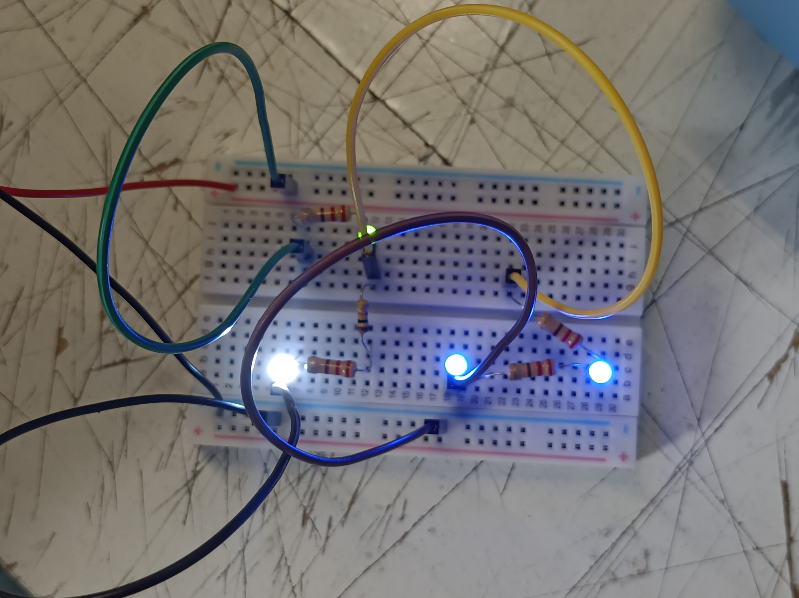
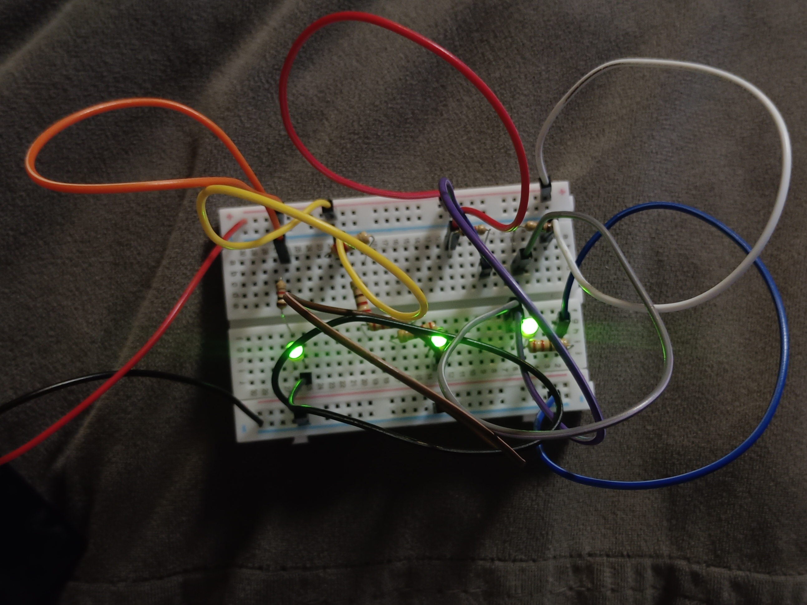
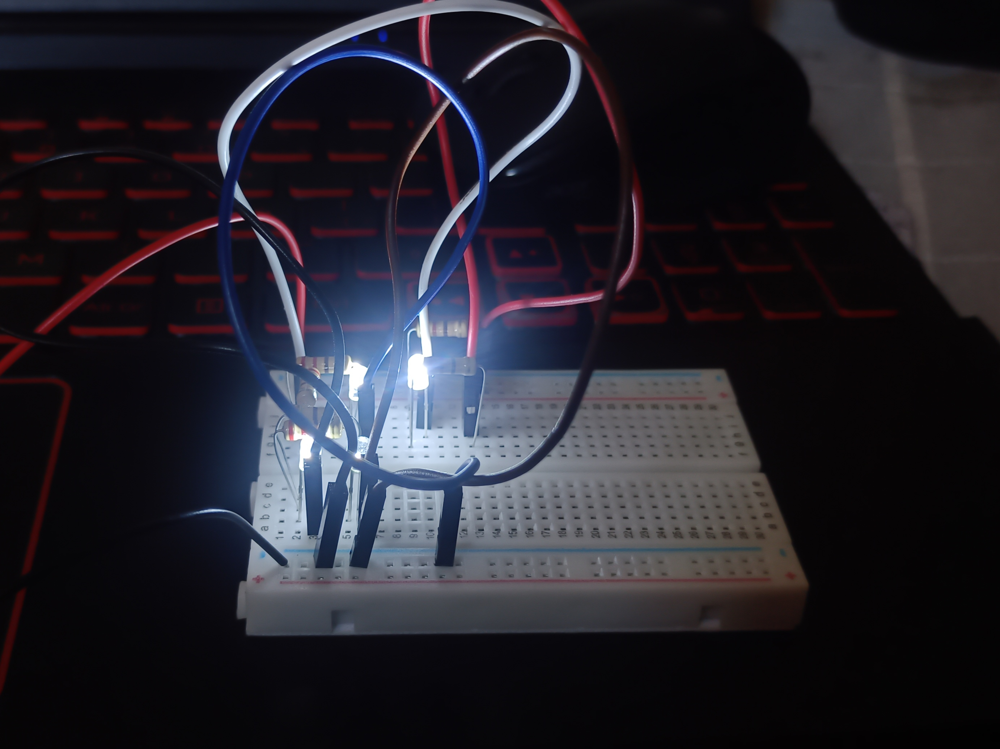

# sesion-02a

### Circuito LED básico

### Circuito LED paralelo

---

## Apuntes clases

Se nos entregaron los materiales en una caja, la cual traía dos potenciómetros B100k, cables Dupont, una protoboard, un parlante, cuatro chips, un broche de batería, 10 resistencias de 220, 10 resistencias de 1000, y una batería de 9v.

Aprendimos a identificar los valores de los colores que hay en las potencias que nos dieron, y cómo se leen en conjunto:

- Negro = 0
- Café = 1
- Rojo = 2

Los colores se leen de un lado a otro, y para poder identificar la dirección nos guiamos por el dorado que siempre suele ser el último, indicando el porcentaje.
Los primeros dos colores son los primeros dos dígitos, mientras que el tercer color es la cantidad de ceros, por ejemplo, rojo-rojo-café-dorado es igual a 220 Ω, ya que el rojo equivale a 2, y el café a 1, indicando que solo hay un cero.

### Circuitos

Se nos mostraron ejemplos de circuitos en la pizarra para enseñarnos que no solo existen los circuitos básicos, sino que también están los paralelos, en donde los LED son independientes. Aparte, se nos mostró que hay distintas maneras en las que se puede representar la batería, la cual no necesariamente tiene que estar como un solo símbolo, sino que se puede separar a los dos extremos como 9v y 0v.

### Encargo LQXTLC (Lo Quito X Ti, Lo Coloco)

#### Primer circuito

| loquitoportilocoloco | D1  | D2  | D3  | D4  |
| ---                  | --- | --- | --- | --- |
| R1                   |  0  |  0  |  0  |  0  |
| R2                   |  1  |  0  |  0  |  1  |
| R3                   |  1  |  1  |  1  |  0  |
| R4                   |  1  |  1  |  1  |  0  |
| R5                   |  1  |  0  |  0  |  1  |

#### Segundo circuito

| loquitoportilocoloco | D1  | D2  | D3  |
| ---                  | --- | --- | --- |
| R1                   |  1  |  0  |  1  |
| R2                   |  1  |  0  |  1  |
| R3                   |  1  |  0  |  1  |
| R4                   |  1  |  0  |  1  |
| R5                   |  0  |  1  |  1  |
| R6                   |  1  |  1  |  1  |
| R7                   |  1  |  1  |  1  |
| R8                   |  1  |  1  |  0  |

#### Tercer circuito

| loquitoportilocoloco | D1  | D2  | D3  | D4  |
| ---                  | --- | --- | --- | --- |
| R1                   |  1  |  1  |  1  |  1  |
| R2                   |  1  |  1  |  1  |  1  |
| R3                   |  1  |  1  |  0  |  1  |
| R4                   |  1  |  0  |  1  |  0  |
| R5                   |  1  |  1  |  1  |  1  |
| R6                   |  1  |  1  |  1  |  1  |
